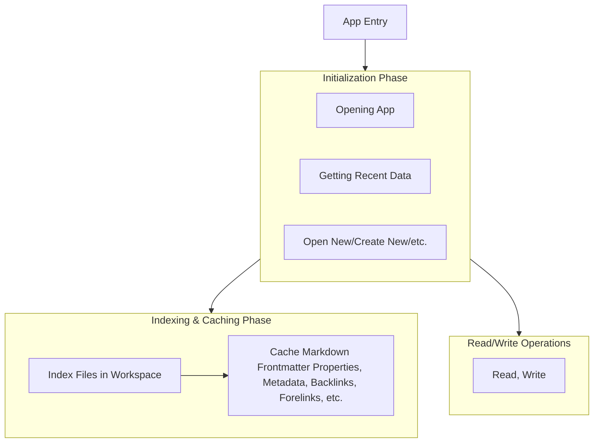
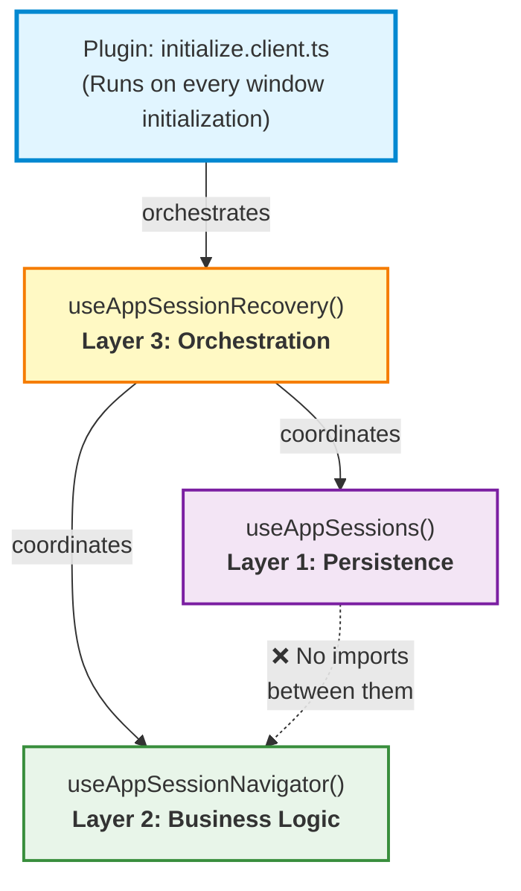
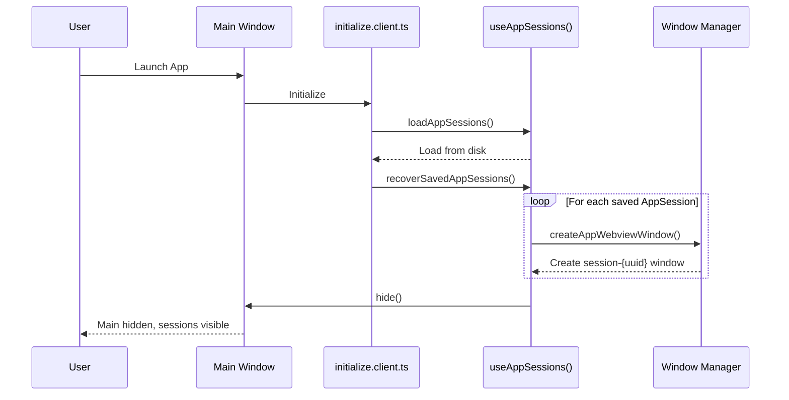
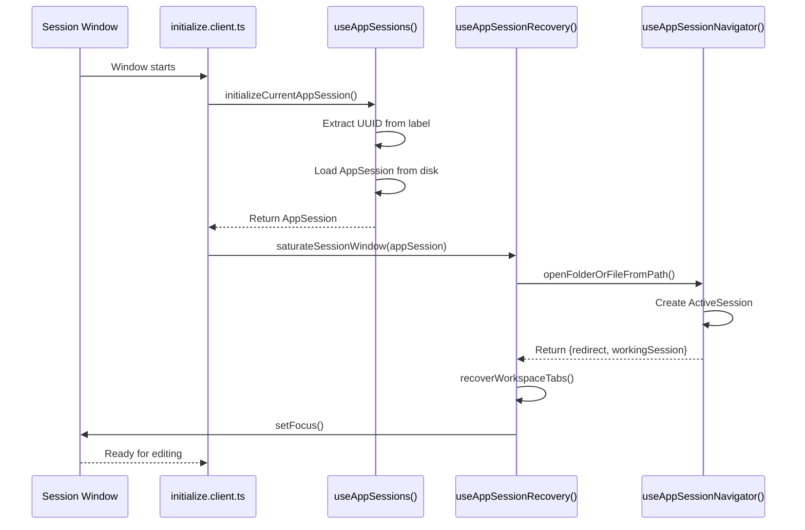

# Concepts and Structures

## Two Modes, One App

The Editor has two main modes: Workspace Mode, and Singlespace Mode.

A Workspace is a folder that contains groups of markdown files and other types of files, which the editor will index everything in the folder and use that indexed information to enhance markdown editing features, i.e. internal links, embeds and etc.
Singlespace is when the Vertex editor is editing a single file without the context of all the files in a folder. Like Notepad, but Rich text editing with Markdown.

When the user opens a folder using Vertex, it automatically opens that folder in Workspace Mode.
When the user opens a file using Vertex, it automatically opens that folder in the Singlespace Mode.

Context is the core difference between a Workspace and a Singlespace/Single-File.

## Operating Flow



---

## Sessions: Two Layers, Two Concepts

Vertex has **two distinct types of sessions** that work together to provide seamless multi-window functionality with persistent state across app restarts.

### ActiveSession (Runtime Layer)

**Purpose**: Represents a workspace or singlespace that's currently active during runtime.

**Characteristics**:
- Lives only in memory (not persisted to disk)
- Created when a user opens a folder (workspace) or file (singlespace)
- Managed by `useActiveSessions()` composable
- Used for current editing context and file indexing

**Structure**:
[Type definition file](shared/types/active/sessions.d.ts)

**Lifecycle**: Created → Used during editing → Destroyed when window closes

### AppSession (Persistence Layer)

**Purpose**: Represents a window's state for recovery across app restarts.

**Characteristics**:
- Persisted to disk (`sessions.json`)
- Contains recovery information (opened tabs, window state)
- Managed by `useAppSessions()` composable
- Used for restoring previous sessions on app startup

**Structure**:
[Type definition file](shared/types/app/sessions.d.ts)

**Lifecycle**: Created → Saved to disk → Loaded on restart → Recovered → Updated → Saved again

### Why Two Session Types?

This separation follows the **Single Responsibility Principle**:

- **ActiveSession** handles runtime editing context
- **AppSession** handles persistence and recovery

This design prevents confusion between "what's currently happening" (ActiveSession) and "what needs to be saved/recovered" (AppSession).

---

## Window Management Model

### Window Types

1. **Main Window** (`main`)
   - The anchor of the application
   - Cannot be destroyed during runtime (only hidden)
   - Manages session recovery on startup
   - Creates other windows
   - Does not have its own editing session

2. **Session Windows** (`session-{uuid}`)
   - Windows for workspace/singlespace editing
   - Each has a unique UUID in its label
   - Can be recovered on app restart
   - Autonomous: propagates data into itself

3. **Utility Windows** (`settings`, `about`, etc.)
   - Non-recoverable windows for app functions
   - Not tracked in session persistence

### Creating a New Session Window

**From the Main Window**:

1. **Create AppSession**
   ```typescript
   const appSession = {
     uuid: generateUuid(),
     sessionType: 'workspace',
     rootPath: '/path/to/folder',
     context: { openedAbsoluteFilePaths: [] }
   }
   ```

2. **Persist AppSession**
   ```typescript
   await useAppSessions().addAppSession(appSession)
   ```

3. **Create Webview Window**
   ```typescript
   createAppWebviewWindow('/loading', `session-${appSession.uuid}`, 'Window Title')
   ```

4. **Hide Main Window**
   ```typescript
   await window.hide()
   ```

### Session Window Initialization

**When a Session Window Starts**:

1. **Identify Self**
   - Extract UUID from window label (`session-{uuid}`)
   - Fetch corresponding AppSession from disk

2. **Open Folder/File** (via `useAppSessionNavigator`)
   - Opens the rootPath from AppSession
   - Creates an ActiveSession for runtime use
   - Navigates to workspace or singlespace route

3. **Saturate/Recover** (via `useAppSessionRecovery`)
   - Recovers previously opened tabs
   - Restores window state
   - Focuses the window

4. **Ready for Editing**
   - User can now edit files
   - ActiveSession tracks current context
   - AppSession periodically updated with state

### Window Closure Flow

**When a Session Window Closes**:

1. **Gather Current State**
   - Collect opened file paths
   - Collect any other window state

2. **Update AppSession**
   ```typescript
   await useAppSessions().updateAppSession(sessionId, {
     context: { openedAbsoluteFilePaths: [...] }
   })
   ```

3. **Check Window Count**
   - If this is the last session window, unhide main window

4. **Destroy Window**
   - Window closes
   - ActiveSession destroyed (not needed in memory)
   - AppSession persists (saved to disk for recovery)

### Session Rules

- **Main window** cannot be destroyed unless quitting the entire app
- **Windows are autonomous**: They propagate data into themselves (no forced context passing)
- **Only session windows** are recoverable on app restart
- **Session recovery** happens on the main window at startup
- **Multiple session windows** can exist simultaneously

---

## Composable Architecture: Three-Layer Design

To maintain clean code and prevent circular dependencies, Vertex's session management follows a **three-layer architecture**.

### Layer 1: Persistence - `useAppSessions()`

**Responsibility**: Pure CRUD operations for AppSession objects.

**What it does**:
- Load/save AppSessions from/to disk (`sessions.json`)
- Add, remove, update, get AppSessions
- Track which sessions exist
- Recover saved sessions on main window startup

**What it does NOT do**:
- ❌ Open files or folders
- ❌ Create ActiveSession objects
- ❌ Handle navigation
- ❌ Directly recover tabs

**Key Functions**:
- `addAppSession(session)` - Add new session
- `removeAppSession(sessionId)` - Remove session
- `updateAppSession(sessionId, partial)` - Update session
- `getAppSession(sessionId)` - Retrieve session
- `loadAppSessions()` - Load from disk
- `saveAppSessions()` - Save to disk
- `recoverSavedAppSessions()` - Create windows (main window only)
- `initializeCurrentAppSession()` - Get current window's session

### Layer 2: Business Logic - `useAppSessionNavigator()`

**Responsibility**: Opening files/folders and creating runtime sessions.

**What it does**:
- Show file/folder picker dialogs
- Determine if path is workspace (folder) or singlespace (file)
- Create ActiveSession objects for opened paths
- Navigate to appropriate routes
- Initialize workspace/singlespace indices

**What it does NOT do**:
- ❌ Manage AppSession persistence
- ❌ Know about window sessions or recovery
- ❌ Load from or save to disk

**Key Functions**:
- `openFolderOrFile(asFile)` - Opens picker dialog
- `openFolderOrFileFromPath(path)` - Opens specific path

**Returns**:
```typescript
{
  redirect: 'workspace' | 'singlespace',
  workingSession: ActiveSession
}
```

### Layer 3: Orchestration - `useAppSessionRecovery()`

**Responsibility**: Coordinate between persistence and business logic for recovery.

**What it does**:
- Takes an AppSession (from Layer 1)
- Uses useAppSessionNavigator (Layer 2) to open folder/file
- Recovers tabs based on AppSession context
- Focuses the window

**Why it exists**:
- Breaks circular dependency between Layer 1 and Layer 2
- Provides clear entry point for session recovery
- Keeps both lower layers focused and independent

**Key Functions**:
- `saturateSessionWindow(appSession)` - Main recovery function
- `recoverWorkspaceTabs(activeSession, appSession)` - Tab recovery

### Architecture Diagram



**Key Points**:
- Plugin orchestrates the recovery process
- Layer 3 coordinates both Layer 1 and Layer 2
- Layer 1 and Layer 2 have no direct dependencies (prevents circular imports)
- This separation enables clean, testable architecture

### Design Principles

**1. Separation of Concerns**
- Each layer has one clear responsibility
- No layer does another layer's job

**2. Dependency Direction**
- Layer 3 depends on Layer 1 & 2
- Layer 1 & 2 are independent (no cross-dependencies)
- This prevents circular import issues

**3. Single Responsibility Principle**
- Persistence layer only handles disk I/O
- Business logic layer only handles opening files
- Orchestration layer only coordinates

**4. Composability**
- Each composable can be used independently
- Clear interfaces between layers
- Easy to test each layer in isolation

### Why This Architecture Matters

**Problem We Avoided**: 
Originally, `useAppSessions` called `useAppSessionNavigator` directly in a `saturateAppSession()` function. If `useAppSessionNavigator` ever needed session information, we'd have a circular dependency:

```
useAppSessions imports useAppSessionNavigator
         ↓
useAppSessionNavigator imports useAppSessions
         ↓
   CIRCULAR DEPENDENCY ❌
    (Cannot be resolved)
```

**Solution**:
By creating a separate orchestration layer (`useAppSessionRecovery`), we break the cycle:

```
useAppSessionRecovery imports useAppSessions
useAppSessionRecovery imports useAppSessionNavigator
         ↓
useAppSessions ←─→ useAppSessionNavigator
  (no imports between them) ✅
```

This is a fundamental software architecture pattern: **when two modules need each other, create a third module to coordinate them**.

---

## Complete Initialization Flow

### App Startup (Main Window)



### Session Window Initialization



---

## Key Takeaways

1. **Two Session Types**: ActiveSession (runtime) vs AppSession (persistent)
2. **Three Window Types**: Main (anchor), Session (editing), Utility (features)
3. **Three Composable Layers**: Persistence, Business Logic, Orchestration
4. **Autonomous Windows**: Each window initializes itself using stored data
5. **Clean Architecture**: No circular dependencies, clear responsibilities

This architecture enables Vertex to:
- Restore all your open workspaces on app restart
- Handle multiple editing sessions simultaneously
- Maintain clean, testable code
- Scale to more complex features without architectural problems