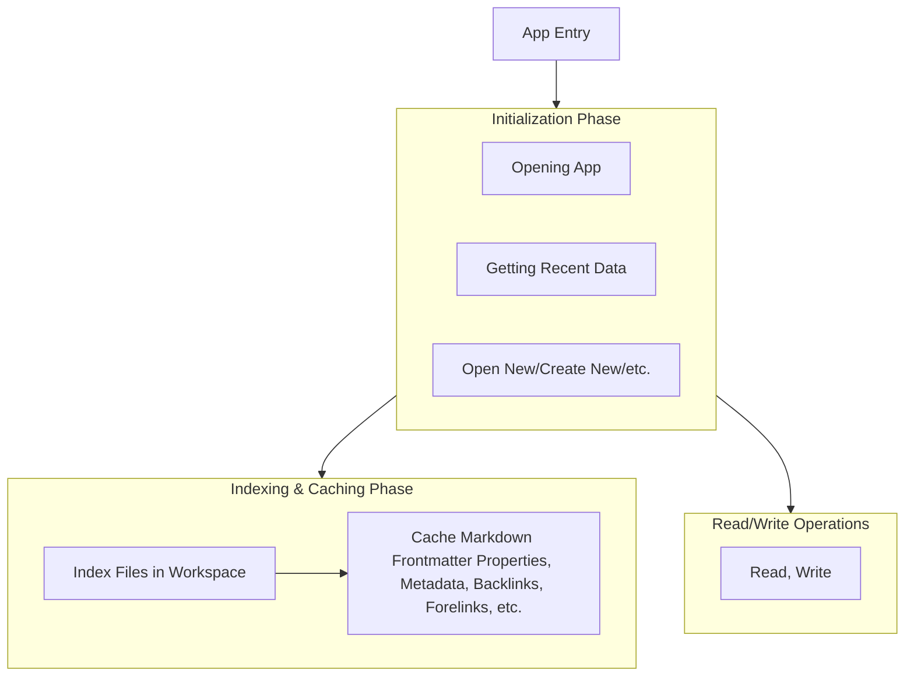

# Concepts and Structures

## Two Modes, One App

The Editor has two main modes: Workspace Mode, and Singlespace Mode.

A Workspace is a folder that contains groups of markdown files and other types of files, which the editor will index everything in the folder and use that indexed information to enhance markdown editing features, i.e. internal links, embeds and etc.
Singlespace is when the Vertex editor is editing a single file without the context of all the files in a folder. Like Notepad, but Rich text editing with Markdown.

When the user opens a folder using Vertex, it automatically opens that folder in Workspace Mode.
When the user opens a file using Vertex, it automatically opens that folder in the Singlespace Mode.

Context is the core difference between a Workspace and a Singlespace/Single-File.

## Operating Flow

