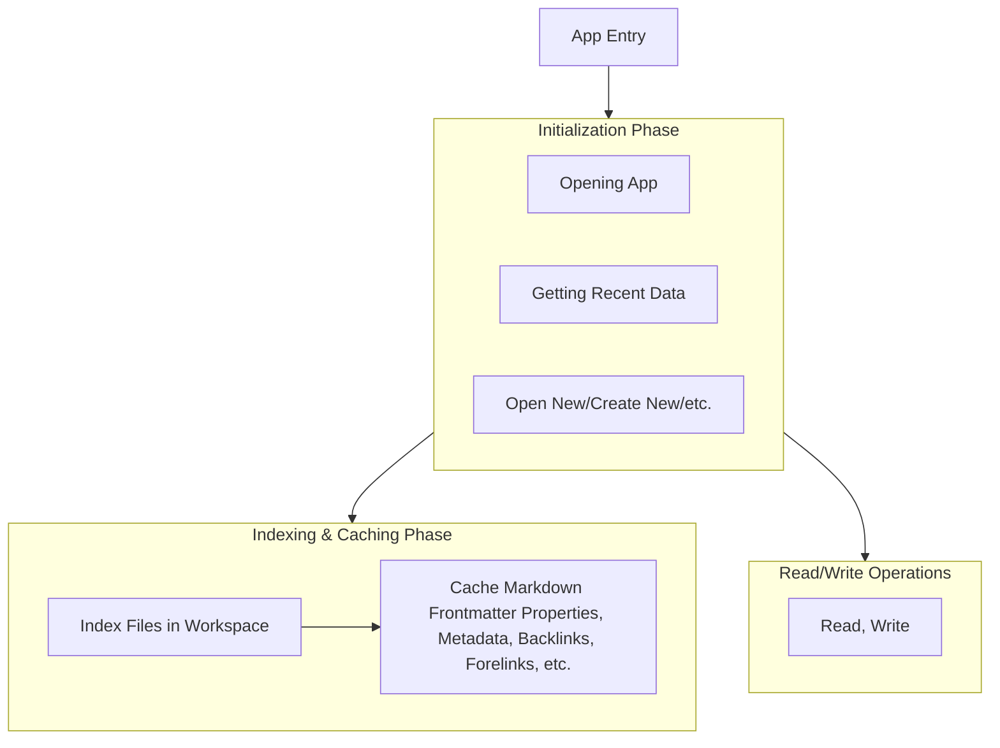
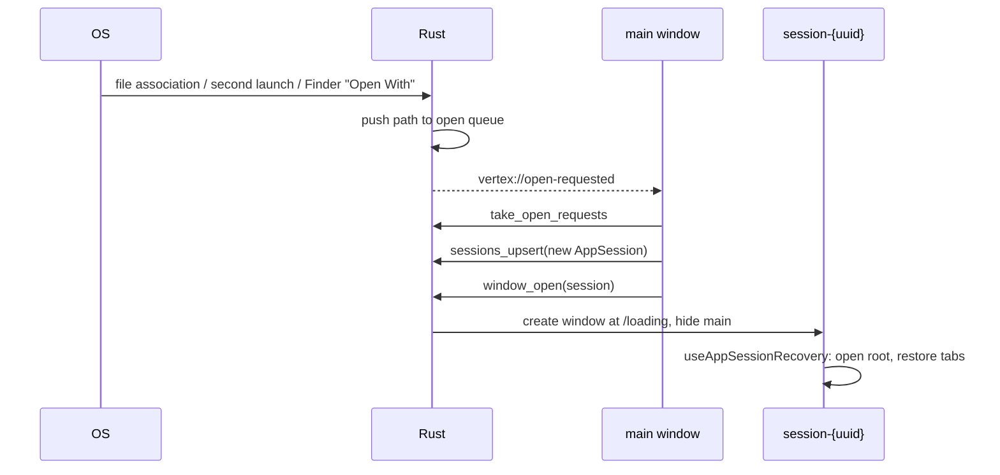
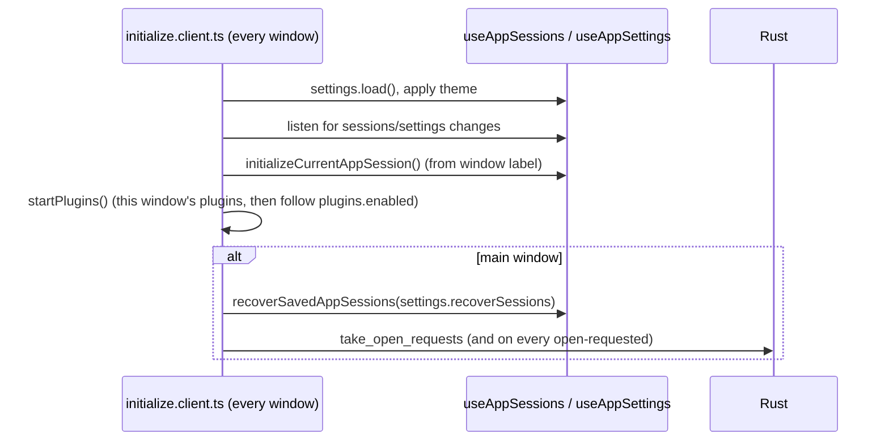

# Concepts and Structures

## Two Modes, One App

The Editor has two main modes: Workspace Mode, and Singlespace Mode.

A Workspace is a folder that contains groups of markdown files and other types of files, which the editor will index everything in the folder and use that indexed information to enhance markdown editing features, i.e. internal links, embeds and etc.
Singlespace is when the Vertex editor is editing a single file without the context of all the files in a folder. Like Notepad, but Rich text editing with Markdown.

When the user opens a folder using Vertex, it automatically opens that folder in Workspace Mode.
When the user opens a file using Vertex, it automatically opens that folder in the Singlespace Mode.

Context is the core difference between a Workspace and a Singlespace/Single-File.

## Operating Flow


```mermaid
graph TD
    N_1[App Entry]
    
    subgraph S_1[Initialization Phase]
        S_1A1[Opening App]
        S_1A2[Getting Recent Data]
        S_1A3[Open New/Create New/etc.]
    end

    subgraph S_2[Indexing & Caching Phase]
        S_2A1[Index Files in Workspace]
        S_2A2[Cache Markdown Frontmatter Properties, Metadata, Backlinks, Forelinks, etc.]
        
        S_2A1 --> S_2A2
    end

    subgraph S_3[Read/Write Operations]
        S_3A1[Read, Write]
    end

    N_1 --> S_1
    S_1 --> S_2
    S_1 --> S_3
```

---

## Sessions: Two Layers, Two Concepts

Vertex has **two distinct types of sessions** that work together to provide seamless multi-window functionality with persistent state across app restarts.

### ActiveSession (Runtime Layer)

**Purpose**: Represents a workspace or singlespace that's currently active during runtime.

**Characteristics**:
- Lives only in memory (not persisted to disk)
- Created when a user opens a folder (workspace) or file (singlespace)
- Managed by `useActiveSessions()` composable
- Used for current editing context and file indexing

**Structure**:
[Type definition file](shared/types/active/sessions.d.ts)

**Lifecycle**: Created → Used during editing → Destroyed when window closes

### AppSession (Persistence Layer)

**Purpose**: A workspace or single file Vertex has opened: the recents list, and what its window restores.

**Characteristics**:
- Persisted to disk (`sessions.json`) by Rust; webviews never write the file
- Contains recovery information (opened tabs, focused tab, expanded folders), as paths relative to the root (the index's `relativePath`), so a moved folder keeps its tabs; old absolute paths are read too (`defaultAppSessionContext`)
- `open` (its window is open now) and `lastOpened` (when its window last opened or closed; recents are newest first) are Rust's, from window events; a webview's copy is ignored on upsert. `pinned` keeps it first and past the cap
- Mirrored per window by `useAppSessions()` (normalized by `defaultAppSession`), kept fresh by the `vertex://sessions-changed` event
- Updated continuously by `useAppSessionPersistence()` while the window is open

**Structure**:
[Type definition file](shared/types/app/sessions.d.ts)

**Lifecycle**: Created on first open → Updated on every tab/folder change → `open` cleared when you close its window, left set when Vertex quits → at the next launch Rust turns `open` into `reopen` → Recovered (per the *Reopen windows on launch* setting) → dropped when you remove it, or past the cap (50 workspaces, 20 files, unpinned, oldest first)

**Recents** (`useRecents`, shared by the start page and the workspace switcher): workspaces and files, pinned first; a gone folder or file is checked whenever the list changes and shown dimmed ("Not found"). Opening one whose path is gone says so with Remove from recents (`useAppSessionActions.openFromPath`). The start page lists both with pin and remove on hover; the switcher (`WorkspaceSwitcher.vue`, title bar: the left sidebar's header, or the tabs header when it's collapsed or in a singlespace window, where it's an icon) has New Workspace…, Open…, the open workspaces (this one ticked) and the recent ones (remove on hover). Badges are the first letters of the folder name's first and last words on a colour hashed from the path (`workspaceBadge`). New Workspace… (start page, switcher, File menu) asks where and what to name the folder, creates it and opens it.

### Why Two Session Types?

This separation follows the **Single Responsibility Principle**:

- **ActiveSession** handles runtime editing context
- **AppSession** handles persistence and recovery

This design prevents confusion between "what's currently happening" (ActiveSession) and "what needs to be saved/recovered" (AppSession).

---

## State Ownership

Anything shared between windows lives in Rust (the kernel crate, `src-tauri/crates/tauri-plugin-vertex/src/state.rs`),
which is the **only writer** of `sessions.json` and `settings.json`. Windows call commands and listen for change events;
they never read or write those files themselves. This removes the cross-window lost-update races the old design had.

The Rust is a Cargo workspace (`src-tauri/crates/`) of Tauri plugins: `tauri-plugin-vertex` (the kernel, plugin `vertex`)
and the features' `tauri-plugin-vertex-ai`, `-chats` and `-git`. The app crate (`src-tauri/src/lib.rs`) only builds them
with the third-party plugins, opens the windows at launch and handles file opening; it defines no command. A plugin's
commands are `plugin:<plugin>|<command>` (the frontend's `vertexInvoke`, `pluginInvoke('vertex-git')`), so every window
is checked against its capability: a command outside it is refused ("not allowed by ACL"). There's no capability file:
the kernel grants each window just before it builds it (`grants.rs`, Window Permissions Plan W2–W4):
- **Its kind's base** (`main`, `session`, `settings`, `about`): the permissions every window shares, `exists` and
  `stat` on any path (not About), and the kernel's commands that kind calls. A session window also gets the file
  commands and Open with the default app under its own root: its workspace with the dot folders, or a single file's
  folder without subfolders. Each is scoped on its command; there's no global `fs:scope`, which Tauri would share with
  every window.
- **Each plugin on for it,** by Rust's own reading: the global `plugins.enabled`, and in a workspace's window its
  `.vertex/settings.json` with the folder's trust (the frontend's rules). A plugin brings what its manifest's
  `permissions` stand for (`shared/plugin/permissions.json`: `network` is `http_fetch`, `secrets` the secret commands,
  `files-outside-workspace` every file) and its crate's commands (`GRANTS` per kind, registered with
  `api::grant(app, PLUGIN, GRANTS)`; a crate whose plugin has no manifest gets nowhere). The manifests come from the
  `layers/*/plugin.json`, embedded by the app crate's `build.rs` (`api::set_plugins`).
- **A plugin turned on** is granted to the open windows before they hear of it: a save of the settings, a workspace's
  or trust regrants first, then emits its change event. **Turned off,** it keeps its grants and runs on: Tauri can't
  take a grant back. `plugins_waiting_restart` lists those; `restart_app` flushes the session windows as quitting does
  and restarts, and the next launch reopens the session windows that were open, whatever the recovery setting.

A label keeps its grants once given (a reopened window isn't granted twice). The app crate's tests resolve each kind's
grant, and a core crate's commands with its plugin on and off, against the real ACL.

What a window **reaches** on disk (`reach.rs`) backs everything else that takes a path. A workspace window reaches its
root; a single-file window its file's folder; Settings every workspace in `sessions.json`. Every window also reaches
what was picked in its dialogs and the clipboard's files it asked for. Roots are canonical and fixed at the window's
first grant, so a link out of the workspace, or a session whose root changes later, leads nowhere new.
- **Kernel and crate commands** taking a path go through a gate around each plugin's `invoke_handler` (`api::gate`):
  the kernel's per command (`kernel_path_args`), git's `root` and `dest`, chats' `root`.
- **Dialogs** are the kernel's (`dialog_open`, `dialog_save`; `pickToOpen`/`pickToSave` in `app/utils/dialogs.ts`),
  shown from Rust: the pick joins that window's reach and file grant (read, or write for Save).
- **Files the webview shows** come through `vertex-file` (`fileUrl(path)`, the kernel's `protocol.rs`), which serves
  only what the asking window reaches.
- **Reveal in Finder** is the kernel's `reveal_paths`: the opener's own command checks no scope.
- **Two rules** close what any window could otherwise do: `trash_restore` takes only what this run trashed, and a new
  value of a program setting (`api::program_setting`: git's `plugins.config.git.path`) must be a file picked in the
  saving window.

- **The kernel's Rust API** (`tauri_plugin_vertex::api`) for plugin crates: `workspace_root`, `write_atomic`, `blocking`,
  the keychain, `install_crypto`, `snippet`, `settings(app)`, `plugin_config(app, id)`, `on_settings_change(app, …)`
  (run by `settings_set` after a save: the AI crate deletes removed providers' keys there), `program_setting(app,
  plugin, key)` (a config key naming a program Rust runs: only a dialog pick may set it), `grant(app, PLUGIN, GRANTS)`
  (which window kinds may call the crate's commands, where its plugin is on). Plugins register in the app crate after
  the kernel, which their setup relies on.
- **Host services** (kernel commands, `ctx` in the plugin contract): `http_fetch` (`ctx.http.fetch`: one GET from Rust,
  outside CORS, refusing local addresses), `search_notes` (`session.index.search(query, {regex, caseSensitive, folder, context, limit})`: a hit per matching path and per matching line, with its number, 20 by default, `more` counting the rest; Rust's `regex`), `secret_get` / `secret_set` / `secret_delete` (`ctx.secrets`:
  the keychain, account `plugin:<id>:<name>`), and `data_get` / `data_set` (`ctx.data.global` / `.workspace`: one JSON
  document per plugin, in `<app data>/plugins-data/<id>.json` or `<root>/.vertex/plugins-data/<id>.json`, written
  atomically and announced as `vertex://plugin-data-changed`; `set` waits for the store's `onChange` listeners to
  register, so a window hears its own write). A plugin id is checked against the manifest's rule. `ctx.dialogs.open` /
  `.save` are the kernel's `dialog_open` / `dialog_save` (`app/utils/dialogs.ts`): what's picked is the window's to read
  or write. `ctx.i18n` is the app's `t` and `locale`; `ctx.ui.theme` (`app/utils/plugins/theme.ts`) is `dark` and
  `value(property)`, a CSS custom property as the page resolves it, re-read when `<html>`'s class or style or
  `<head>`'s styles change, so whatever sets the theme is followed without knowing which.
- **Icons** (`app/plugins/icons.client.ts`): every installed `@iconify-json/*` set is the loader of its prefix
  (`setCustomIconLoader`), each loaded the first time one of its icons is. The app's own icons are in Nuxt Icon's
  client bundle; any other (a community plugin's) would otherwise be fetched from the Iconify API.

| Rust command | Purpose |
|---|---|
| `sessions_list` / `sessions_upsert` / `sessions_remove` | AppSession CRUD; every write is persisted (atomic temp-file + rename) and broadcast as `vertex://sessions-changed`. On first read, `sanitize_sessions` drops invalid and duplicate entries, migrates old ones (`lastUpdated` → `lastOpened`, `trustedDeviceIds` dropped; no `open` means closed), turns `open` into `reopen` and caps the list |
| `settings_get` / `settings_set` | App settings; every write is broadcast as `vertex://settings-changed` |
| `take_open_requests` | Drains the queue of paths the OS asked us to open |
| `quit_app` | Marks the app quitting (windows destroyed from then on keep their session `open`), asks every session window to flush (`vertex://flush-requested` → `vertex://flush-done`), then exits |

The frontend wrapper is `app/utils/stateClient.ts`. It has no Vue lifecycle, so it is safe from plugins and callbacks.

### Workspace index

`useActiveWorkspaceIndex` keeps one reactive entry per file (`fileIndex`, by path) and a non-reactive `LinkGraph`. What reads the index re-renders whenever what it read changes, and an autosave runs `updateIndex` about once a second while typing. So writes that change nothing are skipped: `applyProperties` and `syncLinks` compare first. `fileTree` copies only what the tree shows (`UITreeNode`: uuid, name, relative path, folder, `icon`). A note's save then re-renders neither the Files tree nor the backlink lists. Link targets resolve through the graph (`resolveLink`, used by chat links), not by scanning every file.

The Files view (the files plugin, `layers/files/`: `View.vue` and `Tree.vue`) is a virtual `UTree`: only the rows on screen exist, so a folder of thousands of notes opens and scrolls like a small one. Its rows are flat. Each file row's indent and the dotted nesting guides come from the row's level. There is one right-click menu for the whole tree: the clicked row's `data-id` picks the rows, and the kernel builds the menu (`session.files.menuFor`, `useFileActions`); outside any row it's the empty space's (New items, Paste, Undo/Redo). The tree reads `session.index.tree()` and its settings (`plugins.config.files`: extension in the name or as a tag, default file and folder icons, fold arrows, custom file and folder icons; they were `viewConfig.fileTree`), and keeps its open folders in `session.files.openFolders`, which the session saves. With the plugin off, the kernel's file operations stay: File → New, the palette, a note's drops.

Names don't truncate. Rows wider than the panel scroll sideways, with a thin horizontal scrollbar only (`scrollbar-x`). The virtual list positions rows absolutely, so `fitRows` measures the rows on screen and sets `--row-w` on the tree's DOM; every row is that wide, so highlights span the scroll width. The extension tag or fold arrow is sticky at the panel's right edge. A row whose name runs under it gets `data-clip` and `--clip`, which mask the name so it fades out before the tag; the row's highlight stays whole. Only a row's icon and name (`data-grab`) start a drag; the rest of the row doesn't.

Rows select like a file manager's. The selection is the tree's own (uuids plus an anchor). Reka's tree only receives it to mark rows (`data-selected`, styled `bg-elevated`); its own select is prevented.
- A plain click selects one row and opens a file or toggles a folder. Cmd (macOS) or Ctrl toggles a row; Shift selects the range from the anchor over the rows as shown; Cmd/Ctrl+Shift adds the range. A click with a modifier never opens or toggles.
- Collapsing a folder deselects what's inside it, and removed files drop out, so actions never reach rows you can't see. A click below the rows clears the selection.
- Drag select: pressing on a row's blank part (not its icon and name) or below the rows and dragging draws a box. The rows it touches are selected, or added with Cmd/Ctrl; near the top or bottom edge the tree scrolls. Rows are found by index × row height over the rows as shown, so rows scrolled out of the virtual list count too. The box is drawn on the DOM (teleported to `body`), and the click that ends it is swallowed. For this the tree has no `data-tauri-drag-region`.
- Right-click outside the selection selects that row. Inside a selection of several, the menu acts on all of them: Open in New Tabs, Copy full or relative paths, Reveal in File Explorer, and Delete.
- Keys, with the tree focused: Esc clears the selection; Cmd/Ctrl+A selects every shown row; Delete (or Cmd+Backspace on macOS) deletes the selection, as `fileConfig.deletedFiles` says (below); Cmd/Ctrl+Z and Cmd/Ctrl+Shift+Z (Ctrl+Y on Windows too) undo and redo Files' operations.

Deleting (`deleteFiles`, `useActiveWorkspaceTools`) follows `fileConfig.deletedFiles`, workspace-overridable (Settings → View → Files):
- **`'trash'`** (the default): the system Trash or Recycle Bin, through Rust `trash_item` (the kernel crate's `trash.rs`). On macOS it uses `NSFileManager trashItemAtURL:resultingItemURL:` (`objc2-foundation`), which says where the item went; elsewhere it uses the `trash` crate. `trash_restore` puts an item back: on macOS by moving it from where it went, elsewhere by finding it in the Trash's listing by original path and deletion time. It fails with `taken` or `missing`, and refuses an item this run of the app didn't trash (an item names where it went, which a window could otherwise forge).
- **`'workspaceTrash'`:** a move into `<root>/.trash/`, under a free name (`freeName`). Like every dot-folder, it's hidden from Files and the index. Like `.vertex`, it's named in a session window's file scopes (`grants.rs`), whose `**` doesn't match dot paths.
- **`'permanent'`:** `DeleteFilesModal` asks first, then the items are removed for good, with no undo.
- Either trash asks nothing, and the toast ("Moved N item(s) to the Trash.") has an **Undo** button. An item a clash's Replace displaces goes the same way.
- **Tabs:** every removed item's tab closes through `closeTabElsewhere`, so a shown one hands the page to the next tab first. Undo doesn't reopen the tab.

Files' history (`useFilesHistory`, per session, in memory, 50 steps; a new step clears the redo side):
- **What records a step:** `moveFiles`, `renameFile`, `deleteFiles` and `importItems`, so drops, pastes, Duplicate and the chat's and editor's imports too. Each records a `Change`:
  - the items moved (uuid, from, to);
  - the notes whose links were rewritten, with their text before and after;
  - the folders a merge emptied and removed;
  - what it trashed, with what restoring needs, including every indexed item it took along, so a restore indexes them again under their old uuids (`addFileToIndex(path, root, uuid)`);
  - what it created, with its size and modified time once written.
- **Undo** reverses the change, last part first. Created items go to a trash (never deleted for good), the notes get their old text, the merged folders come back, the items move back, and trashed items are restored. Each part acts only where things are as the change left them: an item still at its new path, a note still reading the rewritten text, a created item unchanged. **Redo** does it again with the same care. Whatever is skipped is named in one toast.
- **Where to undo:** the keys above, the toast's Undo (that step, only while it's the latest), and Undo/Redo items naming the step in the tree's empty-space menu. A move now also has a toast: "Moved N item(s)."
- **The editor is unaffected:** its Cmd/Ctrl+Z is its own, since the tree only sees keys while it has focus.

Rows drag like a file manager's:
- What moves: dragging a selected row moves the selection (what's inside a selected folder goes with it); an unselected row is selected alone first. The drag image is a card with the row's icon and name, with two stacked cards and an "N item(s)" badge for more than one.
- Where a drop lands: onto a folder, into it; onto a file, into its folder; onto empty space, the top level. Items already there stay; a folder never goes into itself or its subfolders. The target folder and its shown rows get one `border-primary` outline (the top level, a ring around the tree), and the target opens before the move so the moved rows stay selected.
- While dragging: a closed folder held for 600 ms opens, and the edges scroll.
- Moves go through `moveFiles` (`useActiveWorkspaceTools`). It plans first (`planInto`, which imports share), then asks, then moves:
  - **Plan:** a folder onto a same-named folder merges, so its contents move in and the emptied folder is removed.
  - **Ask:** every other name clash, ignoring case, goes through `FileConflictModal`: Replace, Keep both ("Note 2.md", `freeName`) or Skip, optionally for the remaining clashes. Cancel moves nothing.
  - **Move:** then `relocateFiles`, which renaming uses too, moves each item on disk and in the index (uuids stay, so tabs and open folders follow). It then updates the links whose text changes, to the items or to any note inside a moved folder, with one dialog for the whole move.
- Whether links are updated comes from `fileConfig.updateLinks`, overridable per workspace (Settings → View → Files): ask (the default), update, or keep. The dialog's "Remember my decision for this workspace" writes it.
- **In Vertex, the drag is native** (`tauri-plugin-drag`, `dragOut` in `outsideItems.ts`), so Finder or Explorer copy the rows as files. `dragstart` is cancelled and the plugin starts the OS drag. Its image is the same card, drawn onto a canvas from the laid-out card (`dragImagePng`, `app/utils/dragImage.ts`), since the plugin takes a PNG rather than an element. A file browser starts all of it with `session.files.drag.start(event, uuids, grab, ended)`.
  - **Back over Vertex,** the drag arrives as plain OS files. The rows it started stay known (`draggedRows`) until the plugin reports the end, plus half a second, since the page may see the drop after that report. The tree moves them, the chat attaches them and a note links them, as with the HTML5 drag.
  - **Copy only:** the drag offers only a copy, so the outside never moves files out of the workspace. Inside the tree, the move therefore shows the copy cursor; asking for a move would get the drop refused.
  - **In a browser** (no Tauri), the tree keeps the HTML5 drag with `FILES_DRAG`.
  - The plugin's command is allowed in every window kind's capability.

Files from the OS (Finder or Explorer) drop onto the tree like rows, with the same targets and outline. `dragDropEnabled` stays false, so they arrive as HTML5 `Files`. `outsideItems` (`app/utils/outsideItems.ts`) reads them while the event lasts: folders whole, skipping `.DS_Store`/`Thumbs.db`/`desktop.ini`. `importItems` then decides what each one is:
- **Already the workspace's:** an item with the same path when the webview gives one, or else the only one with the same name, size and modified time, moves instead (as on the same disk). Option/Alt copies it anyway.
- **Everything else** is copied in through the same planner and clash dialog, written with plugin-fs and indexed parent-first. What arrives is selected, with one "Added N item(s)." toast.

An OS file dropped anywhere else is refused by a window guard in `app.vue`; before, the webview could navigate to the file. Files dropped or pasted into a note go through `useEditorFileDrops` (below), so CodeMirror never puts a file's bytes in as text.

Files into a note (`useEditorFileDrops`, in `useActiveEditorExtensions`): rows dragged from Files become links at the drop point (with a drop cursor). Files dropped from Finder or Explorer, or pasted, are copied into `fileConfig.attachmentsFolder` without asking and then linked; ones the workspace already has are linked as they are. A paste takes the system clipboard's files first, else image data, saved as `Pasted image YYYYMMDDHHmmss.png`. Several go in one per line. A note is linked by its name without `.md` when that finds it, else by its path. Anything else is linked by its path with the extension (`![[…]]` for an image), because the editor finds embeds by full path or by a name without extension. `linkKeys` also indexes a name with its extension (`cat.png`), so Obsidian's `![[cat.png]]` counts as a link and is renamed with the file.

Copy and paste in Files go through the system clipboard's file list (Rust `clipboard_files_get`/`clipboard_files_set`, `arboard`), so there's one clipboard shared with Finder and Explorer:
- **Copy** (Cmd/Ctrl+C, or the menu) puts the selected rows there as files.
- **Paste** (Cmd/Ctrl+V, or the menu) copies whatever files it holds into the selected folder, a selected file's folder, or the top level. It uses `outsideItemsAt(paths)` and `importItems` with `copy`/`inPlace`: by path with `copyFile`, never through the webview. `clipboard_files_get` lets the asking window read the clipboard's files and copy from them (they're outside its workspace); `clipboard_files_set` takes only paths the window reaches.
- **Naming:** in the items' own folder the copies are named like Keep both without asking ("Note 2.md"), as Duplicate does; elsewhere clashes ask.
- **Keys:** the tree takes Cmd/Ctrl+C/V as a keydown or as the `copy`/`paste` event the macOS Edit menu may send, whichever comes first.

### AI requests

AI is the `ai` plugin (`layers/ai/`). Every AI call goes through Rust (`src-tauri/crates/tauri-plugin-vertex-ai`, its commands granted only where the plugin runs) so provider API keys never reach the webview:

| Rust command | Purpose |
|---|---|
| `ai_key_set` / `ai_key_has` | Provider API keys in the OS keychain (`ai-provider:<id>`). There is no getter. No keychain → error, never a plaintext fallback |
| `ai_request` / `ai_request_cancel` | One HTTP request for a provider: the URL must share the provider's `baseURL` origin (`plugins.config.ai.providers`), Rust adds `Authorization`, and the body streams back over a `Channel` |
| `ai_model_catalog` | The models.dev catalog, cached for a day, for model badges |

- `layers/ai/app/lib/aiFetch.ts` wraps `ai_request` as a `fetch`, which ai-sdk (`@ai-sdk/openai-compatible`) and the editor's `aiAssistant({ endpoint: { fetch } })` use unchanged.
- **API** (`layers/ai/app/api.ts`, `ctx.use('ai')`): `config()` (the effective config, checked by `aiConfigOf`), `featureOn(id)`, `resolveFeature(id)` and `resolveProfile(id)` (an `AiModel`: `profile`, `provider`, `fetch` with the profile's params, `languageModel({params?})`, an ai-sdk model; `null` when off or without a model), `updateProfile(id, patch)`, `editProfile(id)` (Settings at the profile's page), `registerFeature({id, label, description})` (listed on Features, removed with the caller's scope). Chat, the editor assistant (`layers/ai-assistant/`) and git (`requires: ["ai?"]`) register `chat`, `editorAssistant` and `commitMessage` and call models only through it, each through its own `ctx.use('ai')`.
- Model parameters: `AiModelProfile.params` (`AiModelParams`: temperature, top P/K, min P, frequency/presence/repetition penalties, max output tokens, seed, stop, `extra`; ranges in `AI_NUMBER_PARAMS`, `layers/ai/shared/params.ts`; `sanitizeModelParams` clamps and drops). `createAiFetch(providerId, params)` adds them as snake_case fields (then `extra` as it is) to POST `…/chat/completions` bodies, only where the request doesn't set the field itself (`withModelParams`; Test's `max_tokens: 5` wins). Chat replies (`languageModel()`), the editor assistant (`AiModel.fetch`; part of `aiEditorExtension`'s key) and the profile's Test send them; chat titles and commit messages don't (`languageModel({params: false})`). Edited in the profile's Parameters (`AiModelParams`): a switch per parameter (off = not sent), a slider saved when let go plus a number input, stop sequences as tags, the extra fields as JSON (saved on blur when it's an object).
- Changing a provider's `baseURL` or removing it deletes its key (`on_settings_change`), so a saved key can't be pointed at another host.
- `plugins.config.ai` (was `aiConfig`, moved by `LEGACY_PATHS`): provider profiles → model profiles (provider + model + system prompt) → features (registered), each falling back to the default model profile. With nothing stored the plugin writes its seed (`AI_SEED`: Local Ollama, an empty Default profile) when it starts. Workspace-overridable (the manifest's `overridable`, trusted folders only): `enabled` and `features` (a shared vault can pick among your own profiles or turn a feature off, never add a provider, model or prompt, nor turn AI back on). The options it carried for others went to their plugins: chat's (X8, `plugins.config.chat`), the assistant's (X8, `plugins.config.ai-assistant`), git's commit messages (X7).
- Switches (Settings → Assistive AI → Features, per scope through `SettingsPageProps.config`): `enabled` turns off every feature; each feature has a switch beside its profile select (off stores `''`; on again removes the entry, or in a workspace whose global choice is off, overrides it with the default profile). `featureOn` is the switch state, `resolveFeature` adds the model and returns `null` when off. The editor assistant (`layers/ai-assistant/`, `aiEditorExtension`) passes its config's `{toolbar, slash, shortcut}` (Settings → Plugins → AI assistant) to `aiAssistant()` (shortcut off passes `shortcut: false`); chat's `titles` gates `autoTitle`. With Chat off (or AI off), the Chats and Chat views are unavailable, Ask in chat leaves the editor menu and File → New Chat is disabled; chats stay on disk and open chat tabs stay. With the `ai` plugin off, chat and the assistant are off with it and git offers no commit message. The Providers and Model profiles pages show a banner while AI is off (`AiOffBanner`).
- Settings pages (the plugin's settings page `ai`, `layers/ai/app/components/Settings.vue`, choosing by the route below `/settings/ai`): Providers and Model profiles are searchable lists (`AiList`: a search field, checkboxes with "select all shown", Remove selected after a confirmation; `selectable` keeps the default profile out) whose rows open a page per item (`Provider.vue`, `Model.vue`, at `providers/<id>`, `models/<id>`). The search is the list's `?q=`, which a page's Back link returns with. A profile's page has General (name, provider, model), Behaviour (tools, system prompt) and Parameters, with Test, Set as default and Remove in its header; a provider's has its connection (name, base URL, key) and its enabled models (the same list, to search and remove several). Profile rows show provider · model and badges (default, tools off, custom parameters), the default first; Duplicate copies a profile. `useAiConfig` (the layer's, over `ctx.config`, global) removes several at once (`removeProviders`, `removeModelProfiles`; the default profile never). Profile pickers (Features, the chat prompt) search names, providers and model ids; Features and the chat's context window link to a profile's page (`createOrFocusSettingsWindow(scope, path)`: an open Settings window gets `vertex://settings-route` and navigates). The nav keeps Providers or Model profiles highlighted on their items' pages.

### Chats

Chats are the `chat` plugin (`layers/chat/`, requires `ai`, uses `workflows` when it runs, `network`). They belong to a workspace (singlespace has none) and are stored by Rust (`src-tauri/crates/tauri-plugin-vertex-chats`); the webview only
calls `layers/chat/app/lib/client.ts`. Its options are `plugins.config.chat` (`storage`, `mode`, `titles`, `importFiles`; were AI's `chatStorage`, `chatMode`, `chatTitles` and `fileConfig.importToChat`), a manifest schema drawn on Settings → Plugins → Chat, each workspace-overridable. Its code takes the window's `SessionContext` (`chatSession()`, set in `onSession`), its context `chatContext()`; git asks it `chatsInWorkspace()` through its API.

| `plugins.config.chat.storage` | Where | Format |
|---|---|---|
| `app` (default) | `<app_data>/chats/<workspaceId>/` | Plain JSON; never in the workspace, never synced |
| `workspace` | `<root>/.vertex/chats/` | age-encrypted; needs the workspace's chat password |

- The workspace id is in `<root>/.vertex/workspace.json` (`{"id": …}`, other keys kept), so app-data chats follow the folder through moves and renames. A *copy* of the folder keeps the id, so both copies share their app-data chats.
- Encryption: `key.age` is a per-workspace X25519 identity encrypted with the password (age scrypt, about 1 s per unlock); each `<id>.chat` and `folders.chat` is encrypted to it. The unlocked identity stays in Rust memory; "Remember on this device" also puts it in the keychain (`chat-key:<workspaceId>`). There's no password recovery. Change password (`chat_vault_change`, Chats view's empty-space menu while unlocked) re-encrypts only `key.age`: the identity, the chats and a remembered key stay as they are.
- Folders are virtual: each chat stores its `folder` inside its (encrypted) content and `folders.chat` keeps empty ones, so folder names never show on disk. Files are flat `<id>.chat`; the index skips the dot-folder.
- Changes from elsewhere (sync from another device): the chat plugin watches `.vertex/chats/` (`SessionContext.watch`, the watcher's paths under a folder the index ignores) and batches them (500 ms) into `useChats.syncExternal`, which re-reads the list and reloads each loaded chat whose file is newer than its own copy (its own saves come back with the same `updated`), unless it's replying. App-data chats only change through Vertex, so they aren't watched.
- Switching `storage` leaves existing chats where they are; each location lists its own.
- The chat file is `{version, id, title, folder, created, updated, profileId?, messages, forks?, mode?, scope?}`; Rust reads only the summary fields and the messages' text parts (search), and keeps every other field as it is (`ChatFile.rest`).
- Mode and scope (the prompt's toolbar; icons only in the side panel): a chat is in Read (changes nothing), Suggest (proposals decided in the editor) or Write (staged changes reviewed after the reply). A chat file's `mode: "ask"` (Read's old name) loads as Read (`toChatMode`); a stored setting `ask` reads as the schema's default. New chats take the config's `mode` (default Suggest); a chat without one follows it. In Suggest and Write, the scope says which notes may change: Named notes (default: the open note, every note and folder attached in the conversation, and the notes the chat created), a folder (at any depth), or the whole workspace (`inScope`, `scopeText` in `lib/tools.ts`). It limits changes only: the model reads any note. The system prompt (`toolsPrompt`, with or without tools) names the current mode and says what all three allow, and words the scope; a change outside it fails with that wording, so the model can ask to widen it.
- Mode switches: a user message records the mode it was sent in (`metadata.mode`), and the model's copy of the first one after a switch starts "(The user switched this chat to … mode.)" (`markModeSwitches`, applied by the transport), as a history of one mode's tool calls otherwise outweighs the system prompt.
- Write mode: `createNote`, `writeNote` and `editNote` (with `execute`) stage instead of writing (`useChats.stage`, into `LiveChat.staging` while the reply runs; `readNote` sees staged text). A new note's path is checked by `newNotePath` (`lib/changes.ts`: workspace-relative, no dot folders, `.md` added); outside a folder scope, new notes are allowed anywhere and count as named. When the reply ends (stopped or failed too), its changes go on it as `metadata.changes` (`ChatChange`: path, `before` (`null` = new), `after`, state), one per note, and `ChatChanges.vue` shows them under the reply: per note +/− lines (`lineDiff` counts, as the diff tab's), and Apply/Discard for the ticked pending ones.
  - A note's path opens its change in a diff tab (`useChats.openChange`): tab kind `chat-change` (the chat plugin's) with its own id (`chatChangeTabId` / `chatChangeOf`: base64url JSON of chat id, message id, path, prefixed `chat-change-`, as tab ids are unique among all tabs), shown by `ChatChangeView` through `TextDiff`, with the chat beside it (`showBeside`, shared with `editorFor`: a chat in a tab moves to the side panel). The versions are the change's own `before`/`after`, never git: it works with or without a repository. The view reads the change from the live chat (loading it), so its state badge, the conflict notice and Apply/Discard follow it; a chat that can't load (a locked vault) or no longer has the change (deleted, rewound) says so. Like git's diff tabs, it isn't restored after a relaunch (the kind doesn't `persist`).
  - Apply (`applyChanges`): only while the note still reads as `before` (else `conflict`, left alone). A note with a mounted editor gets the change dispatched into it (`textChange`: one span, `input.ai`), so ⌘Z undoes it and autosave writes it; otherwise, and for new notes and their missing folders, through `useWorkspaceVault` (the workflows' Vault: self-write marks, index, tab reload).
  - Each send's system prompt says what became of earlier staged changes (`changesSummary`: latest per note).
  - Rewind to a reply undoes the changes applied from the replies it drops, newest first, each only while the note still reads as `after` (a new note moves to `.vertex/trash/chat-<id>/<time>/`); the confirm lists them and a toast says what was undone or left alone. Notes don't follow branch switches.
- Message actions (`ChatView`'s `actions` slot, none while replying): Copy on both sides; Edit on the user's (inline; Enter sends, Esc cancels); Retry on replies, its chevron retrying once with another model profile (`LiveChat.retryProfileId`), and Rewind to here (not on the last reply; native confirm), which drops everything after it; Info on both, opening the context view at that message. Edit, Retry, Rewind and branch switches first withdraw the chat suggestions still waiting in the session's editors (`withdrawSuggestions`).
- Context view (`ChatContextModal.vue`; a chat's ⋯ menu → Context…, or a message's Info): the messages as of opening, with totals (messages, model calls, tokens, time) and per message its parts and raw JSON; a reply's model calls each show the model and profile, start, duration, finish reason, tokens (in, out, reasoning, cached), the notes sent with the characters sent of each, the tools sent loaded and those deferred to tool search, and the instructions without the notes' text; then its tool calls by step. The transport records each call in the reply's `metadata.requests` (`ChatRequestInfo`) on `start`, completes it on `finish`, and carries a continued reply's earlier calls over (metadata arrays replace on merge). Tokens need `includeUsage` (`stream_options.include_usage`); replies from before this have no `requests` and say so.
- Branches (`lib/forks.ts`): Edit and Retry keep what they replace in `forks`, keyed by the message before the fork point (`''` = the start); each entry lists the alternative rests, `null` marking the one in `messages`. A `‹ n/m ›` switcher shows on the message where a fork starts; switching swaps the rests and saves. Rewind keeps only the forks still reachable (`pruneForks`). Only the shown branch is searched. Replies record `modelId` and `profileId`, and a tool round goes on with the reply's own profile, so a retry with another model keeps it through its tool calls.
- Frontend: `useChats(session)` (`layers/chat/app/lib/chats.ts`) holds the index, the vault state and one live `@ai-sdk/vue` `Chat` per chat, shared by its tab and the right panel. `lib/transport.ts` runs `streamText` in the webview on the AI plugin's model (`AiModel.languageModel()`); each send's instructions are the profile prompt plus the active note (its live buffer, `session.editor.content`) and every note attached in the conversation (read through the vault; capped at ~60k characters). The chat saves after each sent message and finished reply; a failed save shows in the chat with Retry.
- Notes and folders are attached from the prompt's Attach picker or by typing `@` (at the start or after whitespace; the query may contain spaces, the list shows while something matches; ↑/↓, Enter/Tab, Esc). In the prompt both share one list, a folder's path ending in `/`; a sent message stores them apart (`metadata.notes`, `metadata.folders`). A referenced folder sends no note text: the system prompt lists its notes' paths (200 per folder) and the model reads what it needs. Replies render with `@comark/vue`'s `<Markdown>` (the chat layer's Nuxt module) on Nuxt UI's prose components, with Comark's `math` (KaTeX) and `rangi` (highlighting; dark colors via `--shiki-dark` in the layer's `chat.css`) plugins and those below. `ChatMarkdown.vue` overrides `a` (wikilinks open the note; other links open the browser) and `pre` (` ```mermaid ` through the mermaid plugin's `Diagram`, the rest through `ProsePre`), and maps `icon` (a folding callout's) to UIcon.
- Replies render with Comark and the editor package's `ofm()` (`@type32/codemirror-rich-obsidian-editor/comark`): wikilinks and embeds, callouts, `==highlights==`, `#tags`, as notes read them; `ofmNodes` (`lib/comark.ts`) turns its nodes into what `ChatMarkdown` draws (`ChatLink` for links, Nuxt UI's callout, a coloured tag). A reply has no frontmatter: `frontmatterAsCode` (same file) replaces Comark's default `frontmatter` plugin by name and shows a leading `---` block (a quoted note's properties) as a ```yaml block. The default parsed it as YAML, hiding it and throwing `YAMLException` on a half-streamed key.
- A chat tab uses the file viewers' header (`ViewerLayout`, published): centred breadcrumbs (its folders, then the title, renamed in place), the chat's menu (`useChatActions`, shared with the Chats view) on the left and "move to side panel" on the right. The side panel keeps a compact header.
- The prompt floats over the messages (`absolute` at the bottom; the scroll area is padded by its measured height, which `UChatMessages` counts when it sizes the last message), so they scroll on under its backdrop blur; the `@` list is blurred glass too.
- Rendering: `ChatView` (header, prompt, alerts) renders `ChatThread` (messages, their actions, the edit box) as its own component, because `ChatView`'s body is a reusable template that re-renders whole on every keystroke. Each message's content is `ChatMessageBody`, so a streamed chunk redraws only the last message. While streaming, `ChatMarkdown` parses at most every 100 ms. A closed tool card has no body (`unmount-on-hide`).
- Long chats: `ChatThread` mounts the latest 50 messages, with **Show earlier** above them (50 more, keeping the first shown message where it was). Only the view is windowed: the chat state, the model's request, branches, undo and the context window use every message. The window is a start index. Replies extend it, a message being edited, retried or branched at stays in view, and a rewind clamps it. Each view (tab, side panel) has its own window, reset when the chat opens again.
- Attachments: notes, folders and images, as workspace-relative refs in the message's `metadata.notes`/`folders`. The stored chat never holds file contents.
  - **Adding them:** with `@`, or by dropping or pasting (`useChatAttach`).
    - Rows dragged from Files carry `application/x-vertex-files` and attach as they are.
    - OS files the workspace already has attach as they are (`session.files.outside`). Others are copied into `fileConfig.attachmentsFolder` (default `Attachments`, created on first use) after `ChatImportModal` asks, unless the config's `importFiles` is `always`; the dialog's Remember sets that for the workspace.
    - A paste takes the system clipboard's files first, then image data, saved as `Pasted image YYYYMMDDHHmmss.png`.
    - Anything else, an image over 5 MB, or an image for a model whose `inputModalities` lack `image` is refused with a toast.
  - **At send:** notes go into the system prompt as text (`notesFor`). Images are read as data URLs (`imagesFor`) and added to the request's copy of the message that attached them, as `file` parts (`withImages`). A model known not to take images fails the send with a message naming it.
  - **In the thread:** images show as thumbnails.
- Chats view rows: each "…" menu is a `ChatRowMenu` that builds its items when opened. The open chat's row (`data-current`) and a drag's target folder are marked on the DOM, not in the list's items, so a tab switch or a drag doesn't redraw thousands of rows.
- Search (Chats view): titles are filtered in the palette; message text is searched by Rust (`chat_search`: case-insensitive, text parts only, newest first, 50 results, a snippet around the first match), so decrypted chats never cross to the webview in bulk.
- A chat tab is tab kind `chat` (the chat plugin's, `persist`) with the chat id as its id, drawn by `ChatView`; `AppSessionContext.openedTabs` restores them and `lastFocusedTab` refocuses one.
- Folders: Move to… (folder and chat menus) never offers a folder itself or its subfolders; moving onto an existing name merges. Which folders are open is kept per session (chat's `expanded` state key), read back from each folder's accordion trigger after a click (mouse, Enter or Space).
- Drag and drop (Chats view): a chat or folder onto a folder, onto a chat (its folder) or onto empty space (top level), with the same rules as Move to…. Rows carry `data-drag` (`chat:<id>` / `folder:<path>`) and a mutation observer makes them draggable, because Nuxt UI passes only `data-`/`aria-` attributes on to a row.
- Titles: a new chat is titled by its first message; after the first reply, the chat's own model writes a 3–6 word title (`generateChatTitle`, cleaned by `cleanTitle`), unless the title was changed meanwhile. A failure keeps the first message's.
- New chat: File → New Chat (⌘⇧L, workspace windows) opens one in a tab.
- Ask in chat: the markdown editor's right-click menu (`RichText.vue`; Cut, Copy, Paste, Select all, then a group per `noteMenuItems` registration: Ask in chat, the chat plugin's, in workspaces) replaces the webview's own, so spelling suggestions and Look Up aren't there. Paste goes through a synthetic `paste` event so CodeMirror's and the editor's paste handling apply; a table's own menu takes its right-clicks first. Ask in chat quotes the selection into the side-panel chat's prompt (a new chat when none is shown) and attaches the note, through `useChats.pendingPrompt`; like every plugin item it runs once the menu has closed, so focus ends in the prompt, and a failure shows as a toast.
- Tools (`layers/chat/app/lib/tools.ts`, sent unless the model profile's Tools switch is off, `AiModelProfile.tools: false`):
  - One list in every mode: a tool made for one mode starts its description with it ("Suggest mode: …"), and called in another it answers with `modeError` (the mode it needs, this mode's equivalent: `proposeEdit`/`proposeInsert` ↔ `editNote`, `writeNote` → `proposeEdit`; in Read, ask the user to switch) instead of running: `execute` tools through `gated`, the editor tools in `onToolCall`.
  - Note tools, run in the webview: `searchNotes` (the grep: `session.index.search`, the kernel's `search_notes` in its crate's `notes.rs`; a word, phrase or `regex`, `caseSensitive`, `folder`, `context` lines, `limit` up to 200; hits as `path:line: text`, path matches too, and how many more there were; dot-names skipped), `readNote` (a path or a note's name, even partial when only one note matches, or no path for the open note; the mounted editor's buffer, else the file; `startLine`/`endLine`, 1-based and inclusive; `readLines` ends a read at the last whole line under 20k characters and returns `endLine`, `totalLines` and `truncated` so the model reads on; it never shows the note), `openInEditorTab` (shows a note in its tab with the chat beside it, `editorFor`; reads nothing), `findFiles` (every file and folder in the index but dot-named ones, by part of the path, a `glob` (`shared/glob.ts`: `*`, `**`, `?`, `{a,b}`; no `/` matches a name anywhere), folder and kind, 200 at most; it replaced `listNotes`, whose rows in older chats keep their name), `folderTree` (`folder`, `depth` default 3: folders indented with their file counts and up to 20 files each, `formatTree`; what a reorganisation reads first). Older chats' `readDocument` rows keep their name; the tool is gone (`readNote` without a path replaced it).
  - File tools (Write mode; asked once with `needsApproval`, the row listing each `from → to` with Move / Don't move or Copy / Don't copy): `moveFiles({moves: [{from, to}]})` moves and renames files and folders (`session.files.relocate`: missing folders made, links follow as `fileConfig.updateLinks` says, one step of Files' undo with its toast) and `copyFiles({copies})` copies them (`session.files.duplicate`). `from` is an exact path, else a note's name; nothing is replaced: a taken target, an item inside another moved folder, or a missing one comes back to the model as skipped with the reason. Applied when approved, not staged with the reply's note changes, so later tools see the real paths. The system prompt says to move with `moveFiles` and never recreate a file at a new path (the reason they exist: a model asked to reorganise wrote copies).
  - `toolFeedback({kind: missing | bug | confusing, tool?, summary, details})` (any mode): the model's report that no tool does what's asked, or that one misbehaves or misled, instead of working around it (the system prompt says so, and to tell the user). Kept in chat's `ctx.data.global` (`lib/feedback.ts`, newest 200, with the time, model and chat), never sent anywhere; Settings → Chat lists them (Copy as a GitHub issue, Remove, Clear).
  - `fetchUrl` (`url`, `offset`; any mode): the AI SDK's web fetch (`experimental_createWebFetchTool` from `@ai-sdk/tool-web-fetch`; `webFetch` in `lib/webPage.ts`, one for the app so its cache of converted pages, 16 for 5 min, outlives a send and `offset` paging doesn't refetch). It asks for `text/markdown` first, turns HTML into Markdown with defuddle over linkedom (both imported on the first HTML page, about 1.1 MB unzipped), passes text types (JSON, XML, plain text) as they are, and refuses the rest (a PDF: `unsupported_content_type`); 20k characters per call, 2 MB per response, 30 s, 5 redirects, each followed by the tool; failures are results (`{type: 'error', errorCode, message}`) and the row shows them as failed. Its transport is `rustFetch` over chat's `ctx.http.fetch`: the kernel's `http_fetch` (its crate's `web.rs`) does one GET with the tool's `Accept`, no cookies, keys or proxy, 15 s, never following a redirect, and returns the status, headers and up to 2 MB + 1 byte of body (so the tool's size check fires) framed as raw bytes (`frame` / `unframe`: the head's JSON length, the head, the body); a resolver that drops non-public addresses (loopback, private, link-local, CGNAT, …) and a check of IP-literal URLs refuse this machine and the local network at every hop, which `rustFetch` reports as a `DownloadError` (the tool: "resolves to a private or reserved address"); other Rust errors go to the console, as the tool tells the model only "The request failed". In the webview, linkedom's `defaultView` is a Proxy over the real window, so defuddle called the webview's `getComputedStyle` on linkedom elements and fell back to the whole page; `webPage.ts` patches `getComputedStyle` to answer a call it rejects (`TypeError`) with no style. `needsApproval` unless the chat allows the URL's `hostname` (`ChatFile.allowedHosts`, kept by Rust's `rest`) or the user wrote the URL in one of their messages (`urlInUserMessages`: user text only, fragment and trailing punctuation aside; the AI SDK's `requireUrlInUserMessage` idea, but other URLs ask instead of failing): the row shows the URL with Fetch, "Always for <host>" (`useChats.allowHost`, then approves) and Don't fetch; typing in the prompt declines.
  - Editor tools: the editor package's `readSelection` (any mode; the open note: the shown one, or from a chat tab the note shown last, `session.editor.lastShownNote()`, while its tab is open; the system prompt names it; run on that editor without showing anything), and our `proposeEdit`/`proposeInsert` (Suggest), the package's with an optional `path` (path or name, `findNote`) for a note that isn't open; it must be in the scope (`editTargetFor`). They have no `execute`: `useChats`' `onToolCall` runs them; a proposal first shows the note with the chat beside it (`editorFor`: a chat tab moves to the side panel, the note's tab opens, and it waits for the editor to mount, `session.editor.viewOf`), then runs `runEditorTool`. An insert without `after` into a note that wasn't open goes at its end. A proposal shows in the editor's preview and answers once accepted or rejected, and `sendAutomaticallyWhen` continues the reply. The preview is the editor assistant's (`layers/ai-assistant/`): with only Chat on (and running), it installs on Chat's model with its own toolbar, slash items and shortcut off.
  - Closing a chat's tab (`closeChatTab`, `editorFor`) moves the route off it first: a route left on a closed tab falls back to SessionTab, which sends the window to the empty page.
  - `askUser` (any mode, no `execute`): 1–4 questions, each open or with options (one, or several with `multiple`). The system prompt tells the model to ask with it rather than in its reply, so the answer continues the same reply instead of costing a new one. `ChatQuestions.vue` shows it in the reply (options, a line for the user's own answer, Answer/Skip) and answers through `addToolOutput` (`{answers}` or `{skipped: true}`); answered, it shows the answers. While it waits, the prompt says so and sending answers it (`{reply}`, with what the message attached) instead of starting a new message (`useChats.send`, `waitingCall`).
  - `runWorkflow` (`path` or name, `note`, `dryRun`; only while the workflows plugin runs): a dry run in any mode (`wouldChange`); a real run only in Write, with `needsApproval`, so the row shows Run / Don't run (`addToolApprovalResponse`; typing in the prompt declines it with the text as the reason) and `sendAutomaticallyWhen` also continues on an approval response. Then the workflows plugin's API (`chatContext().use('workflows')`: `run` / `dryRun`; chat's manifest has `workflows?`) asks for trust when the file isn't trusted, runs it on `note` (else the open note) and reports in its toast with Undo; the model gets the status, steps, fault and the changes (`opText`, 50 at most). Runs aren't staged, limited by the scope or undone by Rewind. The transport sends the model plain copies of the messages: an approved call's input is `structuredClone`d, which Vue's proxies refuse.
  - `bash` (`command`; any mode): a shell in the webview, `just-bash` (an interpreter in TypeScript with grep, sed, awk, jq, find, sort, diff, xargs and more; the browser build, imported on the first command, about 1.3 MB) over an `InMemoryFs` (`lib/bash.ts`). The workspace's text files (`noteFiles`, dot paths left out) sit at `/workspace`, the working directory, each read through the chat's `read` on first use (Write mode: staged text first); no network (none configured, so no `curl`), no Python or JS (not in the browser build). Our own few lines in the AI SDK's bash tool shape (`runCommand`: `{stdout, stderr, exitCode}`, each cut at 30 000 characters, stopped after 10 s or with the reply), as `@ai-sdk/tool-bash` and its sandbox import Node modules. One sandbox per reply (`LiveChat.sandbox`, dropped with `staging` when a new reply starts, or after a `moveFiles`, so notes changed in between read fresh); files stay between that reply's commands, and a note staged by another tool is written into it too.
    - Writes: the sandbox's file system records the paths a command writes (writeFile, appendFile, cp targets) and what it removes or moves away (rm, unlink, rmdir, mv sources). In Write mode, after each command, `sandboxWrites` gives the written files under `/workspace` still there and different from `read`'s text, and `runBash` stages each (`stage`: scope, `newNotePath`); a new file only as a `.md` note. A workspace file moved in the sandbox isn't staged at its new path, and a command that moved or removed workspace files gets a `notOnDisk` line naming them and pointing to `moveFiles` (no tool deletes). The result lists `staged` and `notStaged` (with the reason). In Read and Suggest, writes stay in the sandbox; the description says both.
    - Built-in tools first: its description and the system prompt send the model to the note tools, with the shell for counting across notes, regex searches, many-file changes and jq/awk; the prompt names it only as a search ("run a bash command"), since a small model given its name called it without searching. `rankTools` lists it after every other match.
  - Tool search: every tool but `findTools` (the AI SDK's `toolSearch`, with `rankTools`: words in the name count double, plurals match singulars, this mode's tools before other modes', `bash` last; all tools when none match, so a model searching with the user's topic still finds them) and `askUser` is `deferLoading`. The system prompt explains tool search before the mode: placed after it, a small model called made-up tools. Discovery lasts one generation, so tools the conversation already used or found (`usedToolNames`) are sent loaded. At most 8 steps per reply.
  - Tool calls render as `UChatTool` rows (name, its query/path/command or the outcome: accepted, rejected, failed, declined, asks to run, the raw result when opened; `bash` opens as a terminal: `$ command`, output, exit code, then what it staged). A provider error saying the model can't take tools (`toolsUnsupported`) clears the error and asks (native dialog) to turn Tools off for that profile and retry.

### Git

Git is the `git` plugin (`layers/git/`, requires `ai?`). It runs in Rust (`src-tauri/crates/tauri-plugin-vertex-git`, its commands granted only where the plugin runs), which spawns the installed `git`, so the user's config, credential helpers, SSH agent, hooks and LFS apply as in their terminal; the webview calls `layers/git/app/lib/client.ts` (types in `layers/git/shared/types.ts`). Its settings are `plugins.config.git` (`gitConfigOf`, `layers/git/shared/config.ts`; was `gitConfig`, and `commitMessages` was AI's). Plan and phases: `Git Integration Plan.md` (#42).

- Finding git (`find_git`, cached until it goes missing): the plugin's `path` alone when set (global settings only, so a workspace can't choose the program; a program setting, so only a dialog pick sets it), else on macOS `/opt/homebrew/bin/git` and `/usr/local/bin/git` (an app opened from Finder gets launchd's `PATH`), then `PATH`. `/usr/bin/git` on macOS counts only when `xcode-select -p` succeeds, since the stub opens the developer tools installer.
- Every run: `GIT_TERMINAL_PROMPT=0`, `GIT_OPTIONAL_LOCKS=0`, `LC_ALL=C` (English messages for `classify`), stdin closed, no console window on Windows. Commands run in the repository's top folder (`rev-parse --show-toplevel`; it may sit above the workspace) and paths are relative to it; paths go after `--` with `--literal-pathspecs`, and anything that isn't a plain relative path, or reaches into `.git`, is refused.
- Changing commands take a lock per repository (`Git.locks`), so two never meet on `index.lock`; reads don't wait.
- Expected failures come back as `GitError` codes (`missing`, `not-repo`, `auth`, `conflict`, `rejected`, `no-remote`, `no-upstream`, `identity`), read from git's output; anything else is git's message.
- Sign-in: git's own credential helpers (osxkeychain, Git Credential Manager, an SSH agent) are used as configured. When a run fails with `auth`, `useGitRepo.run` (and the clone dialog) asks for a personal access token through `useGitSignIn` (`GitSignInModal`, a new one per ask: the https hosts of the remotes' URLs, a host picker when there are several, the username a URL names or the one saved, the token page of github.com / gitlab.com / codeberg.org, "refused" wording when that host already has one) and runs the operation again once it's saved; cancelling, or ssh remotes only, leaves the toast. Tokens are saved per host (`host[:port]`, lowercase) as one JSON keychain entry (`git-tokens`, since keychains can't list theirs; `git_tokens` lists hosts and usernames, never tokens; `git_token_set` saves, `""` removes). Fetch, pull, push (`Repo::net`, every remote's fetch and push hosts) and clone (its URL) go through `run_signed`: when one of those hosts has a token, that run gets `-c credential.helper= -c credential.helper=HELPER` (the user's helpers are off for it, so none stores the token) and the `host username token` lines in `VERTEX_GIT_CREDENTIALS`; `HELPER`, a shell function, answers `get` only for an https request to a listed host (case-insensitive) and keeps a username the URL names. The token is never in arguments, `.git/config` or logs, but git's hooks of that run inherit the variable. Without a token for those hosts (or with ssh remotes only), the keychain isn't read. Settings → Git (the plugin's settings page) lists the hosts with Remove.
- Pull merges unless the user set `pull.rebase`; push of a branch without an upstream goes to `origin` (or the only remote) and tracks it; init uses `main` unless `init.defaultBranch` is set; discard restores what the last commit has and deletes the rest.
- `round_trip_against_a_real_repository` runs it all against real git (init, stage, discard, commit, log, a bare remote, a rejected push and a conflicting pull) with the user's and system config kept out.
- The Git view (`layers/git/app/components/ChangesView.vue`, registered as `git`, left by default, workspace windows) shows `useGitRepo(session)` (`app/lib/repo.ts`, over the view's `SessionContext`): the status, refreshed from the watcher's `changed` event (every event under a whole-folder root, dot paths and the app's own writes included; debounced 250 ms), on window focus and after each operation. Operations go through `run`, which shows what's running (`busy`) and, on failure, refreshes first and then explains the `GitError` in a toast with the next step (Pull for `rejected`, Abort merge for a conflict, the setup step for `identity` and `no-remote`); other errors show git's message. `missing` replaces the view with the setup card and `not-repo` with the setup wizard (below), whose Create runs `git_init` with `.gitignore` lines (`.DS_Store`, `Thumbs.db`, `desktop.ini`, `.vertex/trash/`, `.vertex/**/*.tmp`, and `.vertex/chats/` when the user unticks Sync chats, asked only when chats are stored in the workspace: AI's `chatStorage` until X8), of which Rust's `add_ignores` appends only those the file lacks.
- In the view: the branch picker (switch, check out a remote branch by its short name, create from the typed name), ahead/behind, **Sync** (commit every change with the box's message or "Update N file(s)", pull when the branch tracks one, push), a Merging alert with Finish merge and Abort, the Conflicts, Staged and Changes lists (status letters with their meaning on hover; open, stage, unstage, discard after a native confirmation; buttons show on hover or focus), and the commit box (Commit commits the staged changes, or every change when none are staged). Rows map repository paths to the workspace with `GitStatus.prefix`; files outside the workspace list but don't open. The lists are one virtual list (`useVirtualList`: section headers 32 px, rows 28 px), since a new repository lists every file; the commit box is its own component (`GitCommitBox`, its message read and cleared by the view through the exposed instance for Sync), so typing doesn't re-render the rows (before: about half a second per keystroke with 500 changed files). Header buttons go through the view's `actions(list)`.
- Conflicts: a pull that conflicts leaves a merge or, with the user's own `pull.rebase`, a rebase (`GitStatus.merging` for either, `rebasing` for the second: `rebase-merge`/`rebase-apply` in the git folder); its conflicted files have their own list, first (`isUnstaged` leaves them out of Changes). A row opens the file, to fix the markers, and has **Keep mine** (this device's version), **Keep theirs** (the remote's) and **Mark resolved**; the header marks all resolved, and its right-click menu keeps all mine or all theirs. `git_resolve(paths, remote)` checks one side out and stages it: a merge's "theirs" is the remote's side, but a rebase replays this device's commits onto the remote's, so there it's "ours" (`ls-files -u` tells which side has the file; when the chosen side deleted it, `git rm`; paths without a conflict are left alone). Mark resolved stages the file, after a confirmation when `git_conflict_markers` still finds a line starting `<<<<<<< ` or `>>>>>>> `. The alert says Merging or Rebasing; **Finish merge** / **Continue rebase** (`git_merge_continue`: `git commit --no-edit`, or `rebase --continue`, or `--skip` when keeping theirs left the replayed commit with nothing to apply; a later commit may stop on conflicts again) is enabled once no conflict is left; **Abort** (`merge --abort` or `rebase --abort`) is always there. git never opens an editor (`GIT_EDITOR=true` on every run), and a rebasing pull sets local changes aside meanwhile (`--autostash`).
- Auto-sync (`useGitAutoSync`, `app/lib/autoSync.ts`, started in the plugin's `onSession` beside `watchGitPresence`, so it runs without the Git view): `autoSync = {interval, onOpen, pullOnFocus}` from the plugin's effective config, all off by default (`gitConfigOf` keeps them off unless set, the interval a positive number of minutes). It's overridable per workspace in trusted folders only (the manifest's `trustedWorkspace`: a shared vault's committed `.vertex/settings.json` can't start committing and pushing someone's edits); `path` stays global. Settings → Git (`components/Settings.vue`, over `SettingsPageProps.config`) edits it for the scope chosen (rows show "Changed in this workspace", a warning with Trust workspace while the folder isn't trusted); the Sign-in tokens there are this computer's whatever the scope. Every `interval` minutes and, with `onOpen`, once when the window knows it's a repository: commit every change (the model's message with `commitMessages.autoSync`, else "Update N file(s)"), pull when tracking, push; with `pullOnFocus`, a pull when the window gets focus, at most once a minute. It skips while a merge, rebase or conflict is waiting; after `auth` it stops (`autoSyncPaused`) until an operation from the Git view succeeds (`useGitRepo.run` clears it). A failure shows once (a warning toast with Open Git) until a run succeeds.
- Setup: no git shows a card (`data-git-missing`): on macOS **Install developer tools** (`git_install_tools`, `xcode-select --install`, Apple's installer), **Install git** (git-scm.com's page for the OS), **Locate git…** (`ctx.dialogs.open`; saves `path` in the user's settings, which `find_git` then uses alone), **Find git automatically** when a path is set (clears it; the card says the set path isn't a working git), Check again. A workspace that isn't a repository shows the wizard (`GitSetup`, a `UStepper`): Create (the Sync chats choice when chats are kept in the workspace) → your name and email (`git_identity` reads what git would use, `git_identity_set` writes them to the repository's own config) → connect a remote (`origin`, with a link to github.com/new and advice to keep it empty) → Commit and push (`sync`, signing in on the way). Remote and push have Later. The view keeps the wizard up from Create on (`setup`) until it's done or skipped, then starts the tour once. A commit failing with `identity` or a push with `no-remote` offers **Set your name** / **Connect a remote** in its toast (`useGitRepo(session, {setup})`), which open that one step (`single`, with Later).
- Tour (`app/lib/tour.ts`, `GitTourPopover`, the layer's `tour.css`): a `UPopover` re-anchored (`reference`) to each step's target, outlined with `.tour-target`; steps whose target isn't on screen are left out. The Git view's tour explains Sync, Branch, ahead/behind, Fetch/Pull/Push, the lists and staging, Commit and History; it runs once after setup (`localStorage` `vertex-git-tour-seen`) and from the view's Tour button. Panel action buttons carry `data-panel-action` (their id) for such targets.
- Clone: the home page's **Clone Workspace…** (home action `clone-workspace`, `GitCloneModal`): URL, the folder to put it in (Documents by default) and the new folder's name (from the URL until edited); refuses an existing folder; signs in (`useGitSignIn` with the URL) and clones again when the remote refuses; then opens the folder as a workspace (`home.openWorkspace`).
- AI commit messages (feature `commitMessage`, registered with `ctx.whenPlugin('ai')`, its own model or the default one; `useCommitMessage`, `app/lib/commitMessage.ts`, through `ctx.use('ai')`): the commit box's sparkle button (hidden while the feature is off, has no model, or the `ai` plugin is off) fills the box for what Commit would take, the staged changes or, when nothing is staged, every change. Commit and Sync also work with an empty box: with `commitMessages.whenEmpty` (on by default; Settings → Git, under Commit messages while AI runs, per workspace too) the model writes the message first (the Sync button says "Writing message…"), else, or when the model fails (after a toast), it's "Update N file(s)" (`useGitRepo.commit` for what Commit takes). `commitMessages.autoSync` (off by default) has auto-sync's commits written by the model too, falling back quietly. `generateText` with `COMMIT_INSTRUCTIONS` (`shared/commitMessage.ts`) sends the files with their status letters, the diff (`git_diff` of the index and/or the working copy; new files are only listed) cut at 16 000 characters with a note saying so (`commitPrompt`), and the 10 latest subjects for the repository's style; `cleanCommitMessage` drops reasoning, a code fence and wrapping quotes.
- Right-click (`UContextMenu`): a file row has Open changes, Open file, Open in Default App, Stage (Changes) or Unstage (Staged), Discard changes (Changes), Copy relative path (repository-relative), Copy full path and Reveal in File Explorer (the last three as in the file tree; open and reveal go by the file's index entry, `session.files.openWithDefaultApp` and `reveal`, so they're off for deleted files and files outside the workspace); a section header has its bulk action, and Changes also Discard all changes (asks first).
- Diff tabs (tab kind `git-diff`, drawn by `GitDiffView`; a chat change's diff is kind `chat-change`, see Chats → Write mode): a row's click opens its file's changes, the disk (Changes) or the index (Staged) against the last commit; a conflicted file opens itself instead. The tab id is the whole spec (`diffTabId` / `diffSpecOf` in `app/lib/diff.ts`: base64url JSON of top, path, side, old path), so the page needs only the route and the same diff reopens the same tab; it never matches a file uuid, so file-removal paths don't close it, and persistence drops it (the kind doesn't `persist`). The two versions come from `git_show_file` (HEAD, the index, a commit and its first parent) and the disk; `TextDiff` (`components/Diff/`, published in `~/plugin/ui`, git-free: two texts in, a `header` slot with the counts) draws them with `lineDiff` / `splitRows` (`shared/utils/textDiff.ts`), numbered and folded, side by side from 760 px, only the rows on screen (`UScrollArea virtualize`, each row measured since long lines wrap; find in page reaches only those). Working tree and staged diffs reload (debounced) on the watcher's `changed` event for their own file or the repository's `.git/`, not for other files' saves, keeping unfolded runs open; unchanged text isn't diffed again.
- History (`GitHistoryView`, view `gitHistory`, bottom by default, `tab: true`): only where `isGitRepo(root)` holds (`watchGitPresence`, started in the plugin's `onSession`: one `git status` when the window opens, again when `.git` appears or disappears; the Git view's status keeps it current too), so other workspaces get no bottom area for it. `graphRows` (`layers/git/shared/graph.ts`) gives each commit a lane and its row's lines (through, into the dot, out of it); lanes never move sideways and a parent another lane already waits for is joined at once. The list pages `git_log` in 300 at a time near its end and draws only the rows on screen (`useVirtualList`); it reloads, as many rows as are loaded, when the head, branch, upstream or ahead/behind change. A selected commit (`GitCommitDetails`, its own component so scrolling the list doesn't redraw it) shows its message, author, date, id (copy), parents and files, each opening a diff tab against its first parent. The Git view's History button uses `session.views.show` (its pane, else a tab).

### Canvas

`.canvas` files ([JSON Canvas](https://jsoncanvas.org), as Obsidian writes them) open in the canvas plugin's viewer (`layers/canvas/`, `Viewer.vue`; workspace windows; a singlespace shows the JSON in the code editor), drawn and edited by `@type32/jsoncanvas-editor` (`<JsonCanvas>`, from its Nuxt module, which the layer installs). Plan and phases: `plans/Canvas Plan.md`; the move into its layer: `plans/Plugin Architecture Plan.md`, X2.

- **Text ↔ document:** the tab's text is parsed once and each edit is written back in Obsidian's format (`stringifyCanvas`); the tab autosaves it like a note. Unknown data, unknown card types and edges to missing cards are kept. A file that isn't valid JSON Canvas shows why and is never written.
- **The host** (`app/lib/host.ts`, `useCanvasHost`) is what cards get from the workspace, through the viewer's `session` (`SessionContext`), by workspace-relative paths: files from the index (`files.assetUrl`), note text from disk, note cards edited in place (`files.write`), the vault picker for Add file / Swap file / backgrounds (`files.pick`), OS files copied into the attachments folder (`files.importAttachments`, one Files undo step), Files rows dropped or pasted as cards (`files.drag.rows`), a note's links for an edge dropped on empty canvas (`getInternalLinks`), tabs for opened files and `[[links]]`, the system browser for web and mail links, and `ctx.dialogs.save` for Export as image. A host call that fails is a toast. Index events refresh the cards showing those paths.
- **Cards other plugins draw:** a file card whose kind the canvas doesn't draw itself (`fileKind` `other`: a `.base`) shows the embed a plugin registered for its extension (`session.editor.embedFor`), through `PluginMount`, with `EmbedProps` plus `card: true` and the canvas as `this`. With that plugin off, the canvas's generic card shows.
- **Editing:** text cards and note cards edit in the kernel's `NoteEditor` (`<Editor>` with the workspace's links, without a tab's outline, toolbars or AI). A note card's edit changes the note, not the canvas (not a canvas undo step).
- **Links:** the plugin registers a link extractor (`ctx.index.linkExtractor`), so the index reads canvases: their file cards, group backgrounds and text cards' `[[links]]` are links (`canvasLinkTargets`, `layers/canvas/shared/canvasLinks.ts`), and a canvas is a backlink of the notes it shows. Moving or renaming a file rewrites canvases that show it (the extractor's `rewrite`, `rewriteCanvasLinks` over the public `rewriteLinks`), with notes' links, through the same Update links prompt and Files undo. With the plugin off, canvases aren't read for links.
- **Settings:** `plugins.config.canvas` (the manifest's schema, drawn by Settings → Canvas, each key workspace-overridable; written before X2 at `viewConfig.canvas`, read from there through `LEGACY_PATHS`): scroll wheel, Mod+drag, card names, snap to grid and objects, content zoom threshold. The canvas's own snap switches write the workspace's (`ctx.config.set(…, 'workspace')`). Strings: `plugins.canvas.*` (`jsonCanvas.*`: every library string) in en and zh-CN.
- **New Canvas:** File menu, Files' row and empty-space menus, the palette; an empty file is an empty canvas.

### Bases

`.base` files ([Obsidian Bases](https://help.obsidian.md/bases)) open in the bases plugin's viewer (`layers/bases/`, `Viewer.vue`; workspace windows; a singlespace shows the YAML in the code editor). The engine is `@type32/obsidian-bases-parser`: it parses and writes `.base` files as Obsidian does, evaluates its expression language, and runs a view's query (filters, formulas, search, sort, groups, summaries). Plan and phases: `plans/Bases Plan.md`; the move into its layers: `plans/Plugin Architecture Plan.md`, X3.

- **Text ↔ base:** `Base.vue` parses the text once; toolbar edits go through the library's edit functions and come back as the text Obsidian would write, written only when something changes. A file that doesn't parse shows why and is never written. An empty file is Obsidian's default: one table view, "View", over every file.
- **Context:** `createBaseContext` (`app/lib/useBaseContext.ts`) is what the toolbar, menus and layouts share (`provide`d): the base, the shown view (never in the file), `commit`, the query result (a `computed`), the properties menus offer, `this` (the base, or the note or canvas embedding it) and the window's `SessionContext`.
- **Rows:** `useBaseHost` gives the library the workspace's files from `session.index` (frontmatter, tags, links, backlinks), so a query re-runs when a file is created, edited, renamed or deleted. Bases read every file, not only notes.
- **Writes to notes:** cell edits, kanban drops and New write frontmatter through `useNoteProperties` (the public `obsidianYaml`, see Note properties), one Files undo step per edit (`session.files.edit`), and open tabs reload. Kanban's folder columns move files with `files.move`; New creates with `files.create`.
- **Kinds:** a note property's kind (cell editors, menus, header icon) is its stored type first (`session.properties`, the kernel's `usePropertyTypes`), else what its values give; the table header's Property type sets it.
- **Layouts** are a registry (`app/lib/views.ts`), filled through Bases' API (`layers/bases/app/api.ts`, `ctx.use('bases')`): `registerView({type, label, icon, options?, embedStyle?(view), component | mount})`, drawn by `PluginMount` with `{context}` (`BaseViewContext`: the base, the view, the result, `property`, `commit`, `host`, `thisPath`, `embed`, the session, `newItem(preset?)`); the API also gives `Value`, a cell drawn as Bases draws it. `options` are the Configure view fields (`slider`, `select`, `switch`, `text`, `property`, `formula`, `lines`); `embedStyle` sizes a note's embed. Each view is keyed by its name, so switching views draws a fresh layout. A type nothing registered says "Unknown view type", and the file is left as it is. Bases registers `table` (virtualized rows, column widths, summaries, selection and keyboard editing), `cards`, `list` and `kanban`.
- **Map** is a plugin of its own, as in Obsidian (its Maps): `bases-map` (`layers/bases-map/`, `requires: ["bases"]`, `network`) registers `map` (`maplibre-gl`, OpenFreeMap tiles by default; its worker is set by URL so it loads under `tauri://`). With it off, map views say their type is unknown.
- **Embeds:** `Embed.vue` takes each host's props: `![[x.base#View]]` (the plugin's embed, by full name), ` ```base ` blocks (its code block; edits rewrite the block) and canvas `.base` cards (the same embed, drawn by the canvas with `card`, `filePath` and `subpath`). Each gets `host` (`EditorHost`): the session, and the file it's in as `this` (`notePath`: the note, or the canvas); outside a workspace it draws nothing. The editor unmounts embeds scrolled out of view, so their shown view and each file's text live in `useState`. Inside a callout or table cell the editor draws embeds in a read-only copy of the note: a ` ```base ` block there is read-only (as in Obsidian), while `![[x.base]]` still writes its file.
- **Commands:** while a base is open, the palette's Bases group has Add view, Switch view, Copy table and Add item (`registerBaseCommands`); in a note, Insert new base (an empty `Untitled.base` at the root, inserted at the cursor through `session.editor.viewOf`). New Base: File menu, Files' row and empty-space menus, the palette.
- **Links:** the index doesn't read `.base` files, so links in their filters or formulas make no backlinks; Obsidian doesn't count them either.
- **Strings:** `plugins.bases.*` and `plugins.bases-map.*` in en and zh-CN.

### Note properties

A note's frontmatter shows as the editor's properties panel (`@type32/codemirror-rich-obsidian-editor` 0.4, Obsidian's Properties view), in note tabs (`RichText`) and wherever `NoteEditor` edits a note (a canvas's note cards). Plan and phases: `plans/Editor 0.4 Plan.md`.

- **Options:** `usePropertiesOptions(session)` gives `<Editor :properties>` one object for the editor's life. Its fields are getters over the index and the types store, so an index change or a type change never reconfigures the editor (which would rebuild the panel mid-edit). A singlespace gets `{}`: inferred types, no suggestions.
- **Suggestions:** `propertySuggestions` (`shared/utils/index/propertySuggestions.ts`), from the index's notes, as Obsidian offers them:
  - names: the built-ins `aliases`, `cssclasses`, `tags`, then every property as first seen;
  - values: each key's distinct text values, alphabetical;
  - tags: every tag, frontmatter and body, without `#`.
  The panel itself drops the note's own keys and a list's existing items, and narrows by what's typed.
- **Types:** `usePropertyTypes(session)`, Obsidian's vault-wide `types.json` (`{"types": {key: type}}`, Obsidian's type names; helpers in `shared/utils/index/propertyTypes.ts`).
  - **Load:** `.vertex/types.json`, else `.obsidian/types.json`, so a vault starts with Obsidian's types. Reloaded when either changes on disk.
  - **Write:** picking a type (in the panel or a base's header) writes `.vertex/types.json`, never `.obsidian/`.
  - **Owner:** the webview, since a workspace opens in one window only. The fs read scope allows exactly those two files.
- **One frontmatter writer:** edits outside the editor (Bases' property writes, workflows) use `obsidianYaml(frontmatterRange)` (`shared/utils/vault.ts`; public to plugins, with the rest of the vault's helpers, as `shared/plugin/vault.ts`, with `setFrontmatterProperty`): the bases parser's `readYaml`/`writeYaml`, YAML 1.2 core and Obsidian's quoting, so dates stay text and a key like `n` isn't quoted. The editor's own panel writes through the editor, keeping the note's formatting. `.yaml` files (the yaml-form plugin's viewer) keep the editor's `parseYaml`/`stringifyYaml`.
- **Index:** the editor's `parseFrontmatter` (YAML 1.2 since 0.4) keeps dates as text, which Bases reads as written.
- **Strings:** the panel's labels are editor labels (`app.editor.labels.ui.properties.*`, en and zh-CN, through `LABEL_KEYS`).

---

## Window Model

| Window | Label | Notes |
|---|---|---|
| Main | `main` | Anchor. Never destroyed at runtime. Hidden while any session window exists, shown when the last one closes — enforced by the kernel (`sync_main_visibility`) on real window create/destroy events. Recovers saved sessions and serves the OS open queue. Always opens centred. Described in `tauri.conf.json` (`create: false`) and built by the kernel at startup. |
| Session | `session-{uuid}` | One per workspace/singlespace. `uuid` is the AppSession uuid. Starts at `/loading` and initializes itself. Its creation and destruction set the session's `open` (`AppState::session_window`). Reopens at its last size and place (`tauri-plugin-window-state`, by label; pulled back on screen when that monitor is gone). |
| Settings | `settings` | Singleton utility window. Not persisted; keeps its size and place like a session window. |
| About | `about` | Singleton, 420×480, not resizable. |

Only the kernel creates windows (`src-tauri/crates/tauri-plugin-vertex/src/windows.rs`, Window Permissions Plan W1).
A webview asks with `window_open` (`useAppWebviewWindows().openAppWindow`) for a session that's in `sessions.json`,
Settings on a page under `/settings` (and a scope), or About; Rust makes the label, the route, the size and the
overlay title bar, and brings an open one forward instead. No capability lets JavaScript create a window, so a label,
and the capability that goes with it, is never a webview's to choose.

Labels, routes and `useState` keys come from `shared/constants/app.ts`; never hand-build them.

### Switching tabs

In a workspace window, `TabSwitcher` (mounted by the session layout) switches tabs from the keyboard:
- **Ctrl+Tab** on every platform, since Cmd+Tab and Alt+Tab belong to the OS. The tabs come in most-recently-shown order (`recent`, in the component), so a quick press goes back to the previous tab.
- **Held:** after 200 ms a list (`role="listbox"`) appears over the window, lightly blurred (`backdrop-blur-xs`). Tab goes on and ` or Shift+Tab goes back, like macOS's Cmd+Tab; releasing Ctrl, Enter or a click goes to the highlighted tab, and Esc or leaving the window stays put.
- **No list:** Cmd/Ctrl+Shift+] and [ step through the tab bar's order.
- **Keys:** caught on `window` in the capture phase, so the editor and prompts never see them. There are no Ctrl+arrows (macOS's Mission Control and Spaces).
- **Labels:** rows use `useTabLabel`, as the tab bar does.

### Opening something


```mermaid
sequenceDiagram
    participant OS
    participant Rust
    participant Main as main window
    participant Win as session-{uuid}
    OS->>Rust: file association / second launch / Finder "Open With"
    Rust->>Rust: push path to open queue
    Rust-->>Main: vertex://open-requested
    Main->>Rust: take_open_requests
    Main->>Rust: sessions_upsert(new AppSession)
    Main->>Rust: window_open(session)
    Rust->>Win: create window at /loading, hide main
    Win->>Win: useAppSessionRecovery: open root, restore tabs
```

Menu/button opens (`useAppSessionActions`) skip the queue and start at `sessions_upsert`. Opening a path that
already has a window brings that window forward (unminimized) instead; a path that's gone shows a toast instead.

### Closing and quitting

- **Close window**: a single `onCloseRequested` handler (`useAppSessionPersistence.registerCloseHandlers`) awaits the
  last pending session write, then lets Tauri destroy the window. Because state was persisted continuously,
  teardown (`clearTabs`, `clearIndex`) can never overwrite it. Rust shows `main` if this was the last session window,
  and clears the session's `open`.
- **Quit (Cmd+Q)**: `quit_app` marks the app quitting (so destroyed windows keep `open`; `RunEvent::ExitRequested`
  does the same for any other route: Dock, shutdown), sends `flush-requested`, waits for every session window's
  `flush-done` (3 s guard against a hung webview), then exits. No fixed sleeps. A crash leaves `open` set too.

### Startup recovery

The main window reopens the windows that were open when Vertex last quit (`reopen`), according to **Settings →
General → Reopen windows on launch**: `none`, `workspaces`, `singlespaces` or `both`. They open oldest first, so the
most recent ends up in front. One whose folder or file is gone isn't opened; the start page lists those once, with
Remove from recents. Older settings files with `openLastOpenedWindows: true` migrate to `workspaces`. Sessions from
before `open` existed count as closed, so the first launch after that change reopens nothing.

### Panels

- Views are a registry (`app/utils/panelViews.ts`, `panelViews`); a plugin adds one with `ctx.views.panel({id, label, icon, defaultArea, component | mount | action, when?, scroll?, tab?, kbds?, search?})`. Registered by: files, search (palette), git and gitHistory (git), chats and chat (chat), forelinks (outgoing-links), backlinks, writersTools (writers-tools) and toc (outline), each from its layer, the last four shown unless `activeViewer` is `bases`; all of them run in Settings too, which arranges them. `component` is a lazy loader, `mount` draws into an element (both through `PluginMount`, with `PanelViewProps`: the session, `placement` (`panel` or `tab`) and `actions(list)`, which fills the header like `usePanelActions`; drawn once the session is ready); `action` (Search) runs in the Nuxt app's context instead of showing a panel; `when` says whether the window can show it; `scroll` wraps it in the panel's fading scroll area; `tab` lets it open in a tab; `search` is what Search does while the view is shown beside it (Chats searches chats; otherwise the palette, with its ⌘P hint). Views own their behaviour: the TOC jumps through `session.editor.viewOf`, the side-panel chat is `ChatSidePanelView`.
- Header actions: a view declares its buttons from inside its component, `usePanelActions(() => [{id, label, icon, onSelect, disabled?}])` (labels already translated), so they can use its state; each pane (`PanelPane`) provides the slot (`PANEL_ACTIONS`) and draws them, swapping them as its shown view changes. Every pane has the row, whatever its view declares, so switching views doesn't move the view: strip style, the view's name, the actions, then a separator line to the end (a drag region); buttons style, the same under the pane's buttons (without the name on the left, which the button list already shows); at the bottom, after the pills and before the collapse button. The right side's first pane draws its pills and collapse button in the panel's header (buttons style; its row stays under the header) or its name and actions there (strips, `inHeader`). Files has New note and New folder; Chats has New chat and New folder (none while the encrypted store is locked); Chat has New chat; Git has Fetch, Pull, Push, Refresh and History. Outside a pane, `usePanelActions` does nothing.
- View tabs (P5): a view with `tab: true` gets Open in tab at the end of its pane's row (`usePanels.openInTab`: tab kind `view`, the kernel's, registered in `app/utils/contributions.ts`; the tab id is the view id); the tab (`PanelViewTab`) draws the view full-size under a header with its name, the actions it declares (the tab provides its own `PANEL_ACTIONS` slot) and Move to panel (`moveToPanel`: `placeView`, then `closeTabElsewhere`, which moves the route before closing, as chats do). It stays in its pane too, so such a view must work mounted twice. `placeView` shows a view in its panel, first moving it out of Hidden to its `defaultArea`. View tabs persist (`openedTabs`) and come back only for registered `tab` views (the kind's `exists`).
- Views sit in an area (either side, or the bottom area under the editor), in any order with separators, or hidden: `viewConfig.panels = {style, left, right, bottom, hidden}`, overridable per workspace like all of `viewConfig`. View ids are strings (`PanelViewId`); `normalizePanelLayout` (`shared/utils/panelLayout.ts`) keeps any well-formed id (`isPanelViewId`, registered or not, so a view that's missing for a while keeps its place), keeps each view where it first appears (hidden first), tidies separators and puts built-in views missing from a saved layout back on their stock side (`DEFAULT_PANEL_LAYOUT`, also the settings' default; its bottom is empty, as is a layout saved before the bottom area). Other registered views a layout doesn't hold yet go to their `defaultArea` (`withRegisteredViews`). Ids that aren't registered aren't drawn or offered, in a window or in Settings. `search` is an action: it opens the chats' search while Chats shows on its side, else the file palette.
- Panes: a `split` slot starts a new pane on its side, so a side stacks several views at once (`DashboardSidePanel`, a vertical reka-ui `Splitter`; sizes kept in `localStorage` per side and set of panes, like the widths, for every window). `panesOf` (`shared/utils/panelLayout.ts`) cuts a side at its splits; a run with no view (Search alone) joins the pane before it, or after it at the start, so its buttons stay reachable. `tidySlots` keeps splits only between views and drops separators at a pane's edge; a split dropped on Hidden goes. Each pane shows the first of its views listed in `shownPanelViews` (`useActiveLayouts`, saved in the session context; sessions from before panes have `leftPanelView`/`rightPanelView`, read as that list), else its first view; showing a view takes its pane's other views off the list.
- Bottom area (`DashboardBottomPanel`, in `DashboardCenterPanel`'s body under the editor, between the side panels): drawn only while it has a view that can show and isn't collapsed. The page always sits in the first panel of a vertical `Splitter` and the bottom area is added as a second panel, so opening or closing it never remounts the editor; its height is kept like the other sizes. Its panes sit side by side (a horizontal `Splitter`), each with one row of view pills (In the panels only), the view's name and its header actions; the last pane's row ends with the collapse button. Collapsed (`bottomPanelCollapsed`, saved in the session context), it takes no room at all: In the panels, a small `panel-bottom` toggle floats in the editor's bottom-right corner, where the area opens (level with the floating status bar, clear of the scrollbar; only while the area has views; its tooltip names them, "Show the bottom panel: History"); in the strips, its views sit at the foot of the left strip. View → Toggle Bottom Panel does the same (enabled while the area has a view; no shortcut, ⌘J is the AI assistant). Viewers size to their pane rather than the window (`LayoutWrapper`'s root is `h-full`; without scrolling its content fills what the header spacing leaves), so the bottom area never covers them.
- `usePanels(session)` narrows the layout to what the window can show (each view's `when`), cuts each area into panes (`areas[area].panes`: buttons, views, the one shown, where a drop past the last button goes, the split that starts it), and keeps each area's collapsed state (saved in the session context, the right side collapsed by default). An area shows while it has a pane and isn't collapsed. `select` shows a view in its pane; `showView(id)` does it in whichever area holds the view (`useChats` shows a chat with it, and opens it in a tab when the Chat view is hidden). Actions get the view shown in their pane (Search opens the chats' search when Chats shows beside it).
- Styles: `buttons` (default) keeps the buttons in the panes: labelled on the left, icons on the right (the first pane's in the panel's header), with collapse buttons. `strip` puts them in a 2.75 rem strip at each window edge (`PanelStrip`), a split showing as a dashed gap and each pane's view marked; the bottom area's views sit at the foot of the left strip (tooltips point away from the edge). Clicking a pane's shown view collapses its whole area (a side, or the bottom), and each pane shows its view's name. Both strips always show, even empty: the editor centres in the centre panel (a `flex-1` sibling of the sidebars), so equal strips leave it centred in the window while no panel is open, and an open panel moves it by half its width (as panels always did). The traffic-light spacers shrink by the strip's width.
- Rearranging (`PanelButtons`, in all three looks and the Settings editor): HTML5 drag and drop (`usePanelDrag`, one state per window via `provide`, so a view goes from one list to another, across panes and areas), and a right-click menu (`panelSlotMenu`: move up or down, to another area (left, right, bottom), hide, add or remove a separator, split here (not on a pane's first view), remove a split (strips and Settings, where splits show), merge a pane with the one above, or on its left at the bottom (from its buttons), show a hidden view here, reset). In a window, a change is saved to the workspace when it already overrides the arrangement, else globally. Settings → View → Side Panels has the style and the same editor (left, right, bottom, hidden; splits as dashed rows) for the scope being edited.
- The sidebars have stable ids (`left`, `right`), so Nuxt UI keeps their resized widths in its cookie for every window.
- Their headers (`UDashboardNavbar`) carry `data-tauri-drag-region="deep"` (Tauri 2.12's `drag.js`): a press anywhere inside drags the window, the navbar's own slot wrappers and gaps included, which a bare attribute (only the element itself) left out; buttons and other controls inside still click.
- Fading edges: `useScrollFade(el, {bottom?})` (`app/composables/utility/useScrollFade.ts`) gives a scroll area the `scroll-fade` classes (`main.css`): the top fades once it's scrolled and, with `bottom`, the bottom while there's more below (measured again when the content changes). Files, Chats, the panes' scrolling views, the side-panel chat and the Git list (with `bottom`, over its commit box) use it. Fixed overlays (the editor's header gradient, Bases' side edges) are a different thing and stay as they are.

---

## Plugins

Vertex is a kernel plus plugins (plan and phases: `plans/Plugin Architecture Plan.md`). A core plugin ships with Vertex
as a Nuxt layer in `layers/<id>/`; a community plugin is a built folder loaded at runtime (C phases), made with the SDK
(`packages/vertex-plugin`). Every plugin has one contract, `shared/plugin/`.

- **Manifest** (`layers/<id>/plugin.json`, `shared/plugin/manifest.ts`): `id` (lowercase, digits, inner hyphens, at most 50, the folder's name; it names the plugin's settings, data, secrets and grants, so it stays a slug), `name`, `version`, `description`, `icon`, `author`, `repository` (an https Git URL: where the plugin says it lives, shown beside where it was fetched from), `apiVersion` (refused when newer than `API_VERSION`), `minAppVersion` (`0.9.2`; with the app's version, `validateManifest(raw, appVersion)` refuses a later one), `windows` (`main`, `session`, `settings`; default `session`), `requires` (ids, `?` for optional), `permissions` (`network`, `secrets`, `files-outside-workspace`: `PluginPermission`, which must name exactly the keys of `shared/plugin/permissions.json`; a window where the plugin is on is granted what they stand for, State Ownership), `enabledByDefault` (default on), `config` (below). Unknown keys are errors. `validateManifest` lists every problem.
- **Discovery** (`modules/core-plugins.ts`): validates every `layers/*/plugin.json` at startup (a bad one stops `nuxt dev`/`generate` with what's wrong) and generates `#build/core-plugins.mjs`, each manifest with `load: () => import('<layer>/app/plugin')`. A plugin that's off is never fetched. A manifest change restarts Nuxt.
- **Entry** (`app/plugin.ts`): `export default definePlugin({setup(ctx) {…}})`. `setup` runs once per window it's made for, synchronously, inside the plugin's own `effectScope`; a promise returned from it fails the plugin.
- **`ctx`** (`shared/plugin/api.ts`, grows with each phase): `plugin` (id, version, source, `assetUrl(path)`: a file of an installed plugin's folder), `window` (kind, label), `config`, `http`, `secrets`, `data`, `dialogs`, `trust`, `commands.register` / `paletteGroup`, `views.panel` / `tabKind` / `fileViewer` / `statusItem` / `overlay`, `files.type` / `menuItem`, `editor.extension` / `codeBlock` / `embed` / `markdown` / `slashItem` / `toolbarItem` / `noteMenuItem`, `index.linkExtractor`, `settings.page`, `home.action`, `onSession`, `provide` / `use` / `whenPlugin`. The contribution types are in `shared/plugin/contributions.ts`; each point is a registry (`app/utils/registry.ts`: by id, reactive, a duplicate id is an error; `createList` for the id-less extensions and syntax; `app/utils/contributions.ts`). Ids are global, unprefixed (panel and tab ids are saved), except commands'. Wiki-link helpers (`getInternalLinks`, `rewriteLinks`, `renameTargets`) are public in `shared/plugin/links.ts`, the vault's in `shared/plugin/vault.ts`.
  - `config.value`: the plugin's config in this window (the workspace's applicable overrides on top of the user's), every schema field checked and defaulted (`pluginConfig`, `shared/plugin/config.ts`), reactive. `config.set(patch, scope = 'global')`: paths inside the config (`null` removes); `'workspace'` writes the session window's workspace and refuses what the manifest doesn't let it override. `config.overridden(path)`. `definePlugin<Config>` types it; `PluginConfigs` (module augmentation) types `plugins.config.<id>` setting paths.
  - Registrations belong to the scope that's current when they're made: the plugin's in `setup`, the session's in an `onSession` callback, a component's in its setup. Stopping that scope removes them.
  - `onSession(fn)`: runs once the session layout has built the index, restored the tabs and started persistence (`pluginSessions.start`), in a child scope of the plugin's that ends with the session (`pluginSessions.end` on unmount). A plugin turned on during a session runs it at once.
  - `provide(api)` / `use(id)` (`undefined` unless that plugin is running here) / `whenPlugin(id, fn)` (now, or when it starts). `PluginApis` is typed by each plugin's `app/api.ts` (module augmentation of `#shared/plugin/api`).
- **Host** (`app/utils/plugins/host.ts`, Vue only, unit-tested; wired by `runtime.ts`): `startPlugins` runs in `initialize.client.ts` after the settings, the workspace scope and the language, in every window but About.
  - **Which run** (`resolvePlugins`, `shared/plugin/resolve.ts`): those made for the window and on (`settings.plugins.enabled[id]`, else the manifest's default); a plugin whose requirement is missing, off, made for other windows, or in a cycle is off with the reason; the rest in dependency order. Entries are fetched together and started in order; one whose requirement failed to start is off (`requirementFailed`).
  - **States** (`pluginStates()`, reactive): `off` with its reason, `starting`, `active`, `failed` with the error. A failure (load, `setup`, a callback's throw or rejection) stops the plugin's scope, toasts "{name} couldn't start", and isn't retried until the plugin is turned off and on again.
  - **On and off:** a watch on `plugins.enabled` (the Settings window follows the global settings, other windows their effective ones). Newly on: started at once (Rust has granted it already). A running plugin turned off runs on until Vertex restarts, as its window keeps the plugin's grants; nothing has to undo itself.
- **Commands** (`app/utils/commands.ts`): `ctx.commands.register({id, label, icon?, run, enabled?, accelerator?, menu?: {section, group?}, palette?})` adds `<plugin>:<id>` to `registeredCommands` (a duplicate id is an error). The native menu sorts those with `menu` into the kernel's groups of their section (`group`, default 100: the end), after the kernel's `MENU_LAYOUT` items of the same group, in registration order; the palette lists those with `palette` in its Commands group. `useCommands` stays the kernel's way to handle `MENU_LAYOUT` items.
- **Tab kinds:** `ctx.views.tabKind({kind, describe(id), persist?, exists?(id), component | mount})` adds to `tabKinds` (`app/utils/contributions.ts`). A tab of another kind than a file is `ActiveTab.kind` with that kind's id (unique among all tabs); the tab page (`[tabId].vue`) draws it through `PluginMount` with `TabProps` (`{session, id}`) once the session is handed to plugins, an unregistered kind as "This view isn't available."; `useTabLabel` asks `describe` for its name and icon. `AppSessionContext.openedTabs` (`{kind, id}`) and `lastFocusedTab` save the tabs whose kind has `persist`; recovery reopens them after the files, skipping a kind that isn't registered or whose `exists` says no (`defaultAppSessionContext` reads the old `openedChatIds` / `openedViewIds` as kinds `chat` and `view`). The kernel registers `view`; chat `chat` and `chat-change`; git `git-diff`.
- **File viewers** (`app/utils/viewers.ts`): `ctx.views.fileViewer({id, match(ext), loadsText, modes?, priority?, component | mount})` adds to `fileViewers` (`app/utils/contributions.ts`); `viewerFor(ext, mode)` picks, of those working in the session's mode that match, the highest `priority` (default 0), the first registered on a tie. The kernel registers `markdown` (`RichText`: `.md`, `.txt`) and `code` (`CodeText`, priority -100: anything readable as text); plugins register `image`, `yaml` (yaml-form), `latex`, and `canvas`, `bases`, `workflow` (workspace only, so a singlespace opens them in the code editor). `SessionTab` draws the viewer through `PluginMount` with `ViewerProps` (the window's `session`, session and file ids, display path, `fileName`, `contentSaved`, the text for `loadsText`, `renaming`, `disabled`, `assetUrl`, `onRename`; a `mount` gets `setText`), once the session is handed to plugins, and keeps loading, autosave, rename and reload-on-external-change for all of them. A viewer draws its header, rename and status bar with `ViewerLayout` (`app/plugin/ui`, the kernel's `LayoutWrapper`). What only notes need (the editor instance, Insert new base, link clicks, the right-click menu) lives in `RichText`; what every note editor draws with (link list, code blocks, embeds, Markdown syntax, extensions) in `useNoteEditor`, which `RichText` and `NoteEditor` share.
- **Status items:** `ctx.views.statusItem({id, viewers?, placement?, component | mount})` draws `StatusItemProps` (`text`, `filePath`, `fileId`, `session`) for the viewers it lists (default: those that load text), once the session is handed to plugins: `placement: 'bar'` (default) in the status bar, after the viewer's own; `'side'` over the content's right edge, vertically centred (the outline's line outline, which finds its note's editor with `session.editor.viewOf(fileId)`). `SessionTab` provides the shown viewer and the props (`SHOWN_VIEWER`), the viewer's `ViewerLayout` draws them. The word counter is writers-tools' (words, lines and paragraphs for notes and YAML; lines for code and LaTeX).
- **`PluginMount`** (`app/components/PluginMount.vue`): draws any contributed UI (`UiSlot`: a `component` loader, or `mount(el, props)` returning its disposer, run again when the props change) inside an error boundary: what throws draws "{name} couldn't draw this" with the error in its place (`contributionOwner(def)` names the plugin; the kernel's own say Vertex). Tabs, panel views, viewers, status items, settings pages and home actions all draw through it.
- **Core plugins in layers** (X1–X8; every feature is one, so there are no built-ins): `mermaid` (the code block and its preview; `app/api.ts` provides `{Diagram}`, which chat's replies draw through `ctx.use`), `image` (viewer, embed), `yaml-form` (viewer), `latex` (viewer), `outline` (the Table of Contents view and the line outline; its own editor extension keeps each note editor's headings and the active one, and jumps go through `viewOf`), `backlinks` and `outgoing-links` (views over `session.index`), `writers-tools` (its view and the counters), `canvas` (see Canvas), `bases` and `bases-map` (see Bases; Bases' `app/api.ts` provides `registerView` and `Value`), `files` (the Files view, see Workspace index), `palette` (the command palette and the Search view), `workflows` and `ai` (below), `git` (see Git), `chat` (see Chats) and `ai-assistant` (the editor's AI assistant, see AI requests). Their strings are under `plugins.<id>`; their view ids (`toc`, `backlinks`, `forelinks`, `writersTools`, `files`, `search`, `git`, `gitHistory`, `chats`, `chat`) are the ones saved layouts hold.
- **Workflows** (`layers/workflows/`): the `.workflow` file type and viewer (the `@type32/workflows` canvas; its styles and `build.transpile` are the layer's, its classes scanned by `main.css`'s `@source`), the runner (`app/lib/useWorkflowRunner.ts`, one per session, over `session.files.vault()` and `ctx.trust`), its prompts (trust, trash, ask), Run and Dry run in the file menu, Run workflow on a note and the palette's Run workflow group, and its settings (`plugins.config.workflows`: the run limits and Ask before trashing; they were `workflowConfig`). The language is `buildLanguage(extensions)` (`shared/vertex.ts`: Vertex's nodes over `std`, plus each registered extension that builds); `app/api.ts` provides `run(path, {note?})`, `dryRun` and `registerNodes(language => language.node({…}))`, typed with Vertex's effects and types. `app/lib/language.ts` keeps the registered extensions and rebuilds the language when they change.
- **AI** (`layers/ai/`): providers, model profiles and their parameters, keys (through its Rust crate), `aiFetch`, the model catalog, and Settings → Assistive AI (Providers, Model profiles, Features); its config is `plugins.config.ai` (was `aiConfig`). `app/api.ts` provides `config`, `featureOn`, `resolveFeature`, `resolveProfile`, `updateProfile`, `editProfile` and `registerFeature` (see AI requests).
- **Panel views:** `ctx.views.panel(def)` (see Panels); a view gets `PanelViewProps` (`session`, `placement`, `actions(list)` for its header buttons), drawn once the session is handed to plugins (`pluginSession()`, reactive). An action gets `PanelActionContext`, whose `shownSearch` is the shown view's own `search` (Chats'); the palette's Search runs it, else opens the palette.
- **Overlays:** `ctx.views.overlay({id, when?, component | mount})`: drawn once in each session window (`session.vue`) with `{session}`, once the session is handed to plugins. The palette is one (`UDashboardSearch`, ⌘P).
- **File types:** `ctx.files.type({id, extensions, icon, label, new?: {label, command?, description?}})`: the icon `session.files.iconFor(name)` gives (Files' rows); with `new`, an item in `session.files.newItems()` (Files' New menus and header, the palette's Quick actions) and File → New (`file.new.<id>`, group 0, registered by `useSessionCommands` in workspace windows). Canvas, Base and Workflow are their plugins'.
- **File menus:** `ctx.files.menuItem({id, items({session, files})})`: each def's items are a group at the top of a row's file menu (and of a selection's), `session.files.menuFor`; Run workflow is the workflows plugin's.
- **Palette groups:** `ctx.commands.paletteGroup({id, label(), items(), order?})`, read by the palette through `session.commands.paletteGroups()` (and the commands through `session.commands.list()`), computed when it draws: Quick actions 0, Commands 10, registered groups by `order` (default 50; Bases 20, Run workflow 30), Files 100.
- **Settings pages:** `ctx.settings.page({id, label, icon, children?, component | mount})` draws at `/settings/<id>/…` (`pages/settings/[...path].vue`, inside the settings layout), with the rest of the path as `path` (AI's list and detail pages) and `config`, the page's plugin's config in the scope being edited (`ScopedConfig`: `root`, `trusted`, `effective`, `value(path)`, `set(patch)`, `overridden(path)`, `isDirty(paths, defaults)`, `reset(paths, defaults)`, `path(p)` for `SettingsRow`; the plugin is the registration's owner, `contributionPlugin`); the kernel's own routes win, and their ids (`general`, `theme`, `view`, `trust`, `plugins`) are refused. The nav lists them after the kernel's pages in registration order, a page with `children` as a group. `ctx.settings.open(path)` opens the Settings window (or brings it forward) at `/settings/<path>`, on the calling window's scope (AI's `editProfile`).
- **Home actions:** `ctx.home.action({id, label, icon, run(home)})`: buttons on the start page after New Workspace (`data-home-action`); `home.openWorkspace(path)` opens a folder as a workspace. Clone Workspace… is git's.
- **State keys:** the kernel's `useState` keys are `StateKey`'s; a plugin names its own (`plugin.<id>.<name>[.<session uuid>]`, as chat's are).
- **Editor** (`app/composables/active/editor/useNoteEditor.ts`, the one host every note editor uses: the tab's `RichText`, and `NoteEditor`, a markdown editor inside something else: a canvas card, Bases' New item): builds `<Editor>`'s inputs from the editor registries, once the session is handed to plugins.
  - **Code blocks** `{language, component | mount}` and **embeds** `{id, match(ext), linkName?, component | mount}`: each drawn through `PluginMount` by one `mount` per registration per editor (the editor remounts an embed whose function changes), with the editor's props (`codeContent`; `filePath` (workspace-relative), `subpath`, `display`, and the kernel's `assetUrl` for an embed) plus `host: EditorHost` (`session`, `notePath`: `this` for a base). Callouts and table cells inherit them from the editor. A canvas draws an embed in a card the same way, with `card: true`.
  - **Extensions** `ctx.editor.extension(ext | (host) => ext, {nested?})`: in the tab's editor; with `nested`, also in callouts and table cells (the editor's `nestedExtensions`) and canvas cards. The kernel's own (labels, the tracker behind `editorViewOf`, file drops, toolbar, slash menu, block handle) are only the tab's.
  - **Markdown syntax** `ctx.editor.markdown(config)`: Lezer `MarkdownConfig`s, one stable `MarkdownOptions` for every editor and everything nested.
  - **Slash and toolbar items** (`EditorAction`s, `label` an i18n key through `editorLabels`), and **note menu items** `{id, items({host, selection})}`: groups after the kernel's Cut/Copy/Paste/Select all; an item's `onSelect` runs once the menu has closed (Ask in chat).
  - The plugins': Mermaid and Bases code blocks, image and Bases embeds, the outline's heading tracker, the AI assistant's extension, Ask in chat, and the line outline (a `side` status item).
- **Index:** `ctx.index.linkExtractor({id, match(ext), targets(text, getInternalLinks), rewrite?})`: the links of a format that isn't markdown (canvas), for the link graph and rename rewrites; one registered after the index is built relinks the files it matches.
- **`SessionContext`** (`app/layouts/session.vue`'s `sessionContext`): `session`, `views` (`show` (false when no pane can show the view), `openInTab`), `index` (`files`, `tree` (`fileTree`, as Files shows it), `byPath`, `byUuid`, `resolveLink`, `backlinks`, `forelinks`, `links()` and `unresolved(uuid)` straight from the `LinkGraph`, `on`, `search(query, options)`: Rust `search_notes`), `commands` (`list`, `paletteGroups`), `files` (`assetUrl`, `write` (`saveContent`), `create(folder, name)`, `edit(edits, label)` (`editNotes`: one undo step), `move(uuids, folder)`, `undo`, `redo`, `importAttachments` (the workspace's own as they are, the rest copied into the attachments folder: what a note's file drops use too), `outside(drop | 'clipboard' | images)` (the same, described before anything is copied, `import(chosen)`: chat filters and asks first), `relocate(items)` and `duplicate(items)` (to workspace-relative paths, one undo step each, nothing replaced: what can't go comes back as `skipped`; chat's `moveFiles` and `copyFiles`), `pick` (the kernel's vault picker, `VaultPickModal`, which workflows use too); and what a file browser runs, from `useFileActions` (`app/composables/active/useFileActions.ts`), with workspace-relative folders, failures toasted: `iconFor(name)`, `openFolders` (a `Ref` of uuids the session saves), `menuFor(uuids, {added})` (a row's, a selection's or the empty space's menu; `added` gets what Paste and Duplicate made), `newItems(folder?)`, `copy`, `paste(folder)`, `remove` (`fileConfig.deletedFiles`'s dialog when for good), `importDrop(transfer, folder, {copy})`, `drag.start`, `drag.rows` and `drag.carries`, `openWithDefaultApp(uuid)` and `reveal(uuids)` (git's row menu)), `properties` (`types()`, `setType`: `usePropertyTypes`), `tabs` (`open`, `close`, `active`, `list`), `editor` (`viewOf(tabId)`, `embedFor(ext)`, `content(tabId)` (a text tab's live buffer), `lastShownNote()`), and `watch(prefix, fn)` for a dot folder the index ignores (chats' `.vertex/chats/`). Listeners end with the session.
  - **What follows the index:** its entries are reactive (`fileIndex`: an entry's `forelinks` and `backlinks` are synced from the graph by `syncLinks`, its `modifiedTime` set by `updateIndex` on every save), so a computed over `files()` follows the workspace. `links()`, `unresolved()` and `resolveLink()` read the `LinkGraph`, which isn't reactive: they're read again when the entries change. `on` gets `create`, `remove` and `rename`, and `modify` for a change from outside Vertex (the watcher, which skips the app's own writes) or `notifyModified` (`files.edit`); a tab's own save (`saveContent`) updates the entry and fires nothing.
- **Kernel services:** trust (`shared/utils/trust.ts`, `useTrust`) and the vault (`shared/utils/vault.ts`, `useWorkspaceVault`, `session.files.vault()`) are the kernel's, used by workflows, chat and bases.
  - **`ctx.trust`:** `allows(path, hash)` (the file or a covering folder trusts this program; in content mode a record of another program, changed outside Vertex, is dropped first), `trustFile`, `trustFolder(path, nested, pin?)`, `followEdit(path, before, after)` (an edit in Vertex keeps the trust; a new file in a trusted folder gets its first program pinned), and `format({extensions, hash})`, the programs a folder's trust pins (the workflows plugin's).
  - **Settings → Trust** (`pages/settings/trust.vue`, global only): what trust remembers (`trustConfig.fileTrust`, was `workflowConfig.fileTrust`) and the trusted folders and files in one `SettingsList` (Folders and Files as its groups, searched by path; Revoke a row, Revoke for a selection after a question, Revoke all; Add folder; Add file for the registered formats' extensions). Revoking is its own command, `trust_revoke`, which the reach gate doesn't check: removing a record grants nothing, and Trust lists folders trusted from windows long closed (`trust_set` holds a new record to the caller's reach, and refuses `null`).
- **Published UI** (`app/plugin/ui.ts`): Vertex's own UI plugins may import: the Settings rows and sections, `ViewerLayout`, `NoteEditor`, `PluginMount`, `VaultPicker`, `TextDiff` (git's diff tab, chat's change view), `openExternal` (`useAppOpener`'s `openUrlInBrowser`: web and mail links only), `useScrollFade`. Each component's props and events are the contract's (`shared/plugin/components.ts`, `<Name>Props` and `<Name>Emits`, which the component declares itself with), so the SDK types them and `vue-tsc` checks a plugin's template. Nuxt UI is every plugin's UI kit: core plugins' templates get it from Nuxt; community plugins get the app's copy (SDK, below). Vue components, so Nuxt UI's next major can break them; `mount` is the stable tier. Beside the contract, `shared/plugin/` re-exports the kernel's helpers plugins share: `vault.ts`, `links.ts`, `files.ts` (file names and kinds, `IMAGE_TYPES`), `text.ts` (`lineDiff`, `diffCounts`).
- **A plugin's strings** (`shared/plugin/messages.ts`): one file per locale, `{"plugins": {"<id>": {…}}}`, a core plugin's in its layer's `i18n/locales/`, a community plugin's in its package's `locales/`. `checkPluginMessages` is the rule (strings under `plugins.<id>` only, every locale with `en`'s keys and `{params}`, `en` with every key the manifest names): `i18n.test.ts` holds the layers to it with every app locale, the SDK's preset holds a community plugin's to it when it's built. A community plugin's come with `plugins_list` (`locales`, pinned with a workspace's copy: `bundle_hash` covers them), and `loadInstalledPlugins` merges each loadable plugin's `messagesFor` (only `plugins.<id>`, each locale over `en`), so the Settings window has them without running the plugin.
- **SDK** (`packages/vertex-plugin`, `@type32/vertex-plugin`, released to npm by its own script, below; `bun run build` there writes `dist/`, which isn't committed): what a community plugin builds with. A plugin is a folder of `plugin.json`, one `main.js` (an ES module with no imports), `styles.css` when it has CSS, and its assets.
  - **Shared modules** (`shared/plugin/modules.ts`): `SHARED_PACKAGES` (`vue`, the `@codemirror/*` and `@lezer/*` packages the app imports, the editor's root, `/kit`, `/ext`, `@nuxt/ui/composables`) and `SDK_MODULES` (`@type32/vertex-plugin` is `shared/plugin/api.ts`; `/files`, `/links`, `/text`, `/vault` the files of the same name; `/ui` is `app/plugin/ui.ts`). The host's copies are `MODULES` in `app/utils/plugins/community.ts` (typed against that list); `importPluginCode(code, app)` puts them on `globalThis.__vertexModules` (frozen, once) and imports the code from a blob URL. Only the loader imports it, so a window without community plugins never fetches it.
  - **Nuxt UI:** `importPluginCode` also registers Nuxt UI's components on the app, once, by the names the app's templates use, so a plugin's template writes `<UButton>` (a render function `resolveComponent('UButton')`); each loads when first drawn, and those Nuxt registers globally itself (the prose ones) are left alone. The list is `#build/nuxt-ui-components.mjs` (`modules/nuxt-ui-components.ts`: Nuxt's own components from `@nuxt/ui`, from `components:extend`, minus those whose imports reach an optional peer of Nuxt UI the app doesn't install, `UChart`); `.nuxt/nuxt-ui-components.json` (name → file) is the SDK's. `useToast`, `useOverlay` and the rest come from `@nuxt/ui/composables`, a shared module, so a plugin's toast is the app's. Any other `@nuxt/ui` import fails the plugin's build: it would be a second Nuxt UI.
  - **Build** (`scripts/build.ts`, after `nuxt prepare`): `modules.json` (each shared module's value exports as the host has them, read by the TypeScript checker from `community.ts`); `types/` (`tsc` declarations of the SDK's modules, every core plugin's `app/api.ts` and the preset, plus the `.d.ts` files they reach; `#shared/*` imports resolve through the package's `imports`, so the core plugins' `PluginApis` augmentations apply and `ctx.use('bases')` is typed; a type error in that closure fails the build, so the contract imports nothing of the app's); `ui.d.ts` (each component typed by its `<Name>Props` and `<Name>Emits` from `shared/plugin/components.ts`, functions with their signatures); `nuxt-ui.d.ts` (Vue's `GlobalComponents`: each registered Nuxt UI component typed by its file's public path in `@nuxt/ui`'s `exports`, so `vue-tsc` checks `<UButton>`'s props; the SDK depends on `@nuxt/ui`); `theme-libraries.css` and `theme-app.css` (below, without comments and `@source`s); `tailwind.css`; `vite.js`.
  - **Preset** (`@type32/vertex-plugin/vite`, `vertex({entry?, pack?})`): `sharedModules(names)` turns each shared import into reads of `globalThis.__vertexModules` (one pure call per name, so unused ones drop; a name the host's copy lacks fails the build); Vite's library mode to one `main.js` (`codeSplitting: false`), `styles.css`, `public/` copied, `process.env.NODE_ENV` defined, `plugin.json` checked with `validateManifest` and copied; `@tailwindcss/vite`. With `pack`, `plugin.zip` (what's in `dist/`, at its top) beside `dist/`: the asset a release carries. A watching build (`vite build --watch`) excludes `dist/` and `plugin.zip` from what it watches: Tailwind watches what it scans, the output too unless Git ignores it, so each build would start another.
  - **Author docs** (`packages/vertex-plugin/docs/`, shipped in the package; Sample Plugins Plan, D1): Start, the package, `ctx`, the session, UI, config and data, trust, publishing, versions. `src/docs.test.ts` holds them to the contract: every member of `PluginContext` (with `HostServices`) and `SessionContext`, by `ctx.<path>` and `session.<path>` through members typed inline, is named in a heading, and no heading names one that isn't.
  - **Styles:** `@import "@type32/vertex-plugin/tailwind.css"` gives a plugin Tailwind's utilities under the prefix `tw` (`tw:flex`, `tw:hover:bg-elevated`), with no preflight and nothing on `:root`. The prefix is the isolation: a plugin's `<style>` loads after the app's in the same `utilities` layer, and two sheets that both define `.p-4` can't be ordered against each other (a plugin's `p-4` beat Nuxt UI's `sm:p-6` on every card body in the window: measured, 24 px became 16 px), so a plugin's utilities are its own names, set nothing on the app's elements, and don't depend on which classes the app happens to generate. They compile against the host's design system, imported as `reference` in two parts, which the SDK's build cuts down to `@theme`, `@utility` and `@custom-variant` (`designSystem`: a rule that `@apply`s wouldn't compile under a prefix, so the kernel's `@utility` blocks are plain CSS). Tailwind's and Nuxt UI's (`theme-libraries.css`, `theme(inline)`): their values are written into the plugin's classes (`tw:text-red-500`, `tw:p-3`; Nuxt UI's `tw:text-muted` or `tw:bg-elevated` point at its `--ui-*`), so the app defines nothing for them. Vertex's own (`theme-app.css`, from `main.css`'s `@theme static`: fonts, the app's colours; and its utilities): each variable as itself (`@theme inline {--font-sans: var(--font-sans)}`), which the app always defines and changes while it runs (`app.vue` sets the user's fonts on `--font-*`). A value the app changes belongs in `main.css`'s theme. The build compiles what it ships once and fails unless a prefixed class, no unprefixed one, Nuxt UI's colours, the app's variables and its utilities come out.
  - **Versions:** the SDK's dependencies are the shared packages at the host's ranges and its major is `API_VERSION`; `versions.test.ts` fails when the installed host doesn't satisfy them, so a shared package's new major is a new `apiVersion`.
  - **Release** (`scripts/release.ts`): `bun run release <patch | minor | major | prerelease | 1.2.3> [--tag <tag>] [--dry-run]` there bumps the version (`bun pm version`), runs `nuxt prepare`, the build, `tsc` and the SDK's tests, publishes (`bun publish --access public`; a pre-release to the `next` tag, so `latest` never moves to one), then commits the version and tags `sdk-v<version>`, unpushed. It refuses uncommitted changes; `--dry-run` publishes nothing from any tree and puts the version back, as a failed step does.
- **Community plugins** (C2, C2b, C3): each is a folder: installed for every workspace in `<app_data>/plugins/<id>/`, or a workspace's own in `<root>/.vertex/plugins/<id>/`, which travels with it (`plugin.json`, `main.js`, `styles.css`, assets, and `.install.json`, where it was fetched from), off until turned on.
  - **A workspace's plugins** (C3) run only in its session windows, once its folder is trusted and each is accepted: the SHA-256 of its `plugin.json`, `main.js` and `styles.css` (`bundle_hash`, each length-prefixed) is pinned in the record of the trusted folder covering the workspace (`files["<root>/.vertex/plugins/<id>"]`, beside the workflows' pins; `plugin_pin`, `pin_plugin` in `state.rs`), whatever "What file trust remembers" says. A rename carries the pin; revoking the folder drops it. One whose files no longer hash to its pin (changed by sync, Git, another app) is off until accepted again; code already running isn't unloaded. An accepted copy replaces the installed plugin with its id in that workspace's windows; until then the installed one is what it gets. The Settings window runs the global plugins whatever it edits, and knows the edited workspace's accepted ones (their manifests serve the scope's allowlist, the nav and their settings pages).
  - **Trust:** `useTrust.trustFolder` (every Trust button, `ctx.trust.trustFolder` included) lists the folder's own workspace's plugins not accepted in `PluginTrustModal` first (name, version, author, what each asks for, that they run as Vertex does); Trust trusts the folder and pins them, Cancel trusts nothing (it resolves `false`). Pins already in the record are kept when it's trusted again. `useTrust.acceptPlugins(root, plugins)` asks the same about new or changed ones and pins them. A workspace further down a folder trusted with its subfolders isn't scanned: its plugins ask when it's opened.
  - **Sources** (`src/sources.rs`): one string, `plugins.sources.<id>`. `git+https://host/owner/repo#releases` (the newest version tag, `1.2.0` or `v1.2.0` without a pre-release suffix, whose release has a `plugin.zip`; the three newest are tried), `#branch:<b>` (followed), `#tag:<t>` and `#commit:<sha>` (pinned); an https `.zip` URL; a picked `.zip` file or folder (a path). `from_link` reads links as people copy them (a repository, `…/tree/<b>`, `…/-/tree/<b>`, `…/src/branch/<b>`, `…/releases`, `…/releases/tag/<t>`, `owner/repo` for GitHub, `<link>#<ref>`). Everything is HTTPS (`http` only to this computer, redirects included), with no Git client and no forge API: the refs from Git's smart HTTP (`<repo>/info/refs?service=git-upload-pack`, as given, then with `.git`), a release's `plugin.zip` at `<repo>/releases/download/<tag>/` (GitHub, Gitea, Forgejo) or `<repo>/-/releases/<tag>/downloads/` (GitLab), a commit's files at `<repo>/archive/<sha>.zip` or `<repo>/-/archive/<sha>/plugin.zip`: each form tried in turn. Public repositories only; a host without `.zip` archives (sr.ht) can't be installed from.
  - **The built plugin** in what was fetched: `plugin.json` and `main.js` together, at its top, in its one top folder (an archive's), or in `dist/`. A `plugin.json` without `main.js` is a plugin's source, refused with what to install instead (its release, or a branch with the build).
  - **Rust** (`src/plugins.rs` in the kernel crate): `plugins_list({root})` (folders by id, manifests as they are, each with its record and `claimed`, the origin of the repository its manifest names; with `root`, that workspace's too, each with its `hash` now, its `pinPath` and whether it's `accepted`), `plugin_read({id, workspace})` (`{code, styles, hash}`: the three files read once and hashed as read; a workspace copy, the calling window's, is refused unless that hash is its pin), and for the Settings window `plugin_source_resolve(link)` (the source a link reads as, and for a repository its default branch, branches, tags and newest release, for the dialog's choice), `plugin_stage({path} | {source}, root)` (a picked folder or `.zip`, or any source string; fetched or copied into `<app_data>/plugins-staging/`, nothing outside it; returns the raw manifest, what it resolved to, the record of the installed plugin with its id and of `root`'s, and `claimed`), `plugin_discard`, `plugin_install({stage, root})` (checks the id rule, not a core id, `main.js`, known permissions; writes the record; replaces an older copy, and then the windows running it reload; with `root`, into that trusted workspace, pinned), `plugin_remove({id, root})` (the folder, and a workspace copy's pin; its config and data stay) and `plugin_updates({check, root})`. The `vertex-plugin` scheme serves a plugin's folder to the window asking (its workspace's accepted copy, else the installed one; `pluginAssetUrl`, nothing outside it). Rust's catalog for grants is the core manifests plus the installed ones, and for a session window its workspace's accepted ones in place of those with their ids (`catalog_for`); an install or removal regrants and emits `vertex://plugins-changed`.
  - **The record** (`.install.json`, `Record`): the source, its origin (`github.com/o/r`, lowercase, no `.git`: any pick of one repository is one origin; a URL; a path), what it resolved to (`release`, `branch`, `tag`, `commit`, `zip`, `file`, `folder`; the tag or branch; the commit), the fetched file's SHA-256, the version and the time. It's the proven origin: the manifest's `repository` is only what the plugin says.
  - **Updates** (`plugin_updates`): with `check`, each installed plugin's source is asked whether there's something newer (a release with another tag, a branch at another commit, a `.zip` URL with other bytes; a pinned tag or commit, a file and a folder never), one `info/refs` GET per repository (and one per release tag tried) carrying nothing but the `Vertex` user agent; without, the last check's list (nothing is sent). Checked when the user asks (Settings → Plugins → Check for updates), and, only while `plugins.checkUpdates` is on (off by default), a minute after launch and then daily; each check emits `vertex://plugin-updates`, which the main and session windows toast (with Review) while the switch is on. An update is a stage of the same source through the same dialog; nothing installs one by itself.
  - **Catalog** (`app/utils/plugins/catalog.ts`, reactive): the core entries and `loadInstalledPlugins(app, root, runs)` at startup, on `plugins-changed`, on a trust change and (Settings) when another workspace is edited, with each installed one's record (`installedOrigin(id)`) and the workspace's plugins (`workspacePlugins()`). Each manifest is checked with `checkPluginFolder` (`shared/plugin/manifest.ts`: `validateManifest` with the app's version; its folder must be its id, not a core plugin's); an installed one that fails is in `brokenPlugins()`; none that fails loads. `pluginEntries()` is what the window runs (a session window's workspace's accepted copies replacing installed ones), `pluginManifests()` what its scope knows. `missingPlugins(enabled)`: ids turned on that this device has nowhere. Loading one puts its `styles.css` in a `<style data-plugin="<id>">`, then `importPluginCode` (`community.ts`, imported then). The host gets the new list with `setEntries`: a newly installed plugin can be turned on in an open window; a removed one runs until the restart; a running one whose copy changed (the workspace's accepted, or no longer) reloads the window.
  - **Install** (Settings → Plugins → Community plugins): Install… is `PluginGitModal` (a link, Look up, then its latest release, a branch or a tag); beside it, a `.zip` file, a `.zip` URL, or a folder while developing. Then stage, validate, `PluginInstallModal` (name, version, author, description, where it's from (`describeOrigin`, `app/utils/plugins/origin.ts`) and where it says it's from when that differs, an update's version change and what changed in its permissions, requirements and `apiVersion`, the permissions, that it runs as Vertex does; or the manifest's problems; while a trusted workspace is edited, For every workspace / For this workspace only). A plugin from another origin than the copy it replaces, which would get that one's settings, data and secrets, needs its own confirmation. Then the user's settings get `plugins.enabled.<id>: true` and `plugins.sources.<id>`, or the workspace's do (its source only when `shareableSource`: a Git or `https` source, never a path). A community row shows its origin (a link), Update to … when the last check found one, and Use its repository for a plugin that names one it wasn't fetched from. Remove asks (`PluginRemoveModal`), then offers the restart.
  - **This workspace** (Settings → Plugins, while a workspace is edited): its own plugins (accepted or not: "New or changed since it was accepted", with Review; waiting for trust; broken), each with its switch, update, origin, settings and Remove, and the ids its settings turn on that this device has nowhere, with Install from the source the workspace names. A session window says once which of its workspace's plugins it would run but are new or changed (Review: `acceptPlugins`), and which are missing (Review opens this page).
  - **Development:** a plugin installed from a folder stays watched while `plugins.sources.<id>` is that folder (`sync_watches`, at launch and on every settings save). When its files change (paths, sizes, times: macOS reports a folder's files again when they're copied, so events alone would loop), it's copied again and `vertex://plugin-updated` makes each window running it write its session (`pluginSessions.start`'s `flush`) and reload.
- **Settings** (`AppSettings.plugins`, kept for plugins this device doesn't have): `enabled` (id → on/off), `config` (id → its stored config), `sources` (id → where an installed plugin came from: a source string, or a path; a folder is watched), `checkUpdates` (check the sources at launch and daily; default off).
  - **Workspaces** (`shared/utils/settings/scopes.ts`): the allowlist is `settingsAllowlist(manifests)`: the kernel's `WORKSPACE_OVERRIDABLE` plus each manifest's `config.overridable` (`workspace` or `trustedWorkspace`) under `plugins.config.<id>`; a key it doesn't list is global only. `plugins.enabled` is value-aware: any workspace may turn a plugin off; one it turns on runs only once the workspace is trusted (until then Settings → Plugins says "Waits for trust", with Trust workspace). `plugins.sources` is overridable: turning a community plugin on in a workspace, or installing one into it, writes its shareable source there, so another device can install it (Rust's folder watches read the user's own).
  - **A settings page's anatomy** (`app/components/Settings/`, published in `/ui`; Settings Plan, U1): `SettingsScrollLayout` (the header over the scrolling content), `SettingsSection`s, and in a section `SettingsRow`s and nothing else. Only a row pads, so every page lines up: a control that needs the width is a `stacked` row (label over control: the panel arrangement, the CSS editor, a text area), a notice or a preview a stacked row without a label, "nothing here yet" the section's `empty`. A row's and a section's `description` is one line (`truncate`, the whole text as its `title`); what takes more is `info`, behind the info button beside the label (`Settings/Info.vue`, a popover). `anatomy.test.ts` reads every template of the app and the layers and fails on anything else in a section.
  - **Lists** (`Settings/List.vue`, `SettingsList`, published in `/ui` with `SettingsListProps` and `SettingsListAction`; Settings Plan, U3): what lists things in a section, made of `SettingsRow`s. A search over `text(item)` (`v-model:query`, which AI's pages keep in the URL), headings from `group(item)`, its own "nothing yet" (`empty`) and "nothing matches"; with `actions`, a checkbox per row (`selectable` keeps one out), one for all the rows shown, and a button per action that applies to some of the selection ("Revoke (3)"), its `confirm` a native question with the button's text as OK. AI's providers, model profiles and a provider's models, and Trust's records, are its lists.
  - **Schema** (`config.schema`): fields `switch`, `text`, `number` (`min`, `max`, `step`), `select` (`options`), `list`, `color`, `path` (`kind: file | folder`, inside the workspace), each with `key` (a path in the config), `label`, `description` and `info` (i18n keys of the plugin's, checked by the i18n test; they get `{mod}`, ⌘ or Ctrl) and `default`.
  - **Settings → Plugins** (`pages/settings/plugins/index.vue`): Core plugins and Community plugins, each plugin with its icon and its switch, in the scope being edited (Changed in this workspace, Use global), its description, version, author, requirements and permissions, and why it's off (a missing or off requirement, a cycle) or that it failed in this window; its gear opens its nav entry (`pluginSettingsRoute`); community rows have Remove, broken installs are listed with why. `plugins/[id].vue` draws a plugin's schema with `SettingsSection` and `SettingsRow`, its icon in the header: rows follow the scope (Global only, Changed in this workspace, Use global), a reset puts the section back, a trusted-only override in an untrusted workspace shows the trust alert, and a path's Choose… is offered while a workspace is edited.
  - **The nav** (`layouts/settings.vue`, `app/utils/settingsNav.ts`): Vertex's pages (About, General, Theme, View, Trust, Plugins), then Core plugins and Community plugins (installed and the edited workspace's), each a group under its heading, left out when empty, sorted by label in the UI's language. A plugin's entry is the pages it registers (`ctx.settings.page`, with their sub-entries; a page's icon defaults to its manifest's) or else its schema page while it's on in the scope; never both.
  - **Moved settings** (`shared/utils/settings/legacy.ts`): `LEGACY_PATHS` (old path → new) read through `withMovedPaths`: the global settings in `defaultAppSettings` (written at the new paths with the next save), a workspace's in `useSettingsScope` (its next write stores the new path and removes the old). Rows apply in order, so a row may move what an earlier one put somewhere (`aiConfig.commitMessages` → `plugins.config.ai.commitMessages` → `plugins.config.git.commitMessages`); `movedPathsIn` follows the chain too. Path helpers (`getAt`, `withAt`, `withoutAt`) are in `shared/utils/settings/paths.ts`.
  - Switching a plugin off that a window still runs asks to restart (`RestartModal`: Later / Restart now, `stateClient.restart`); until then its row says "Waits for a restart" (Rust's `plugins_waiting_restart`).
- **A layer** (`layers/<id>/`): `plugin.json`; `package.json` (`"type": "module"`, its dependencies; the root lists `layers/*` as Bun workspaces, with `bunfig.toml`'s hoisted linker so there's one copy of each package); `nuxt.config.ts` (its `optimizeDeps`, CSS, `i18n.locales`, `components: [{path: 'components', prefix: '<Prefix>'}]`); `app/plugin.ts`; `app/api.ts`; `app/components/`; `app/lib/` (imported explicitly); `i18n/locales/` (every app locale, keys under `plugins.<id>`); `shared/` (pure logic and tests). Vitest runs `layers/*/{app,shared}/**/*.test.ts` and maps `#layers` to `./layers`.
- **Boundaries** (`shared/plugin/boundaries.test.ts`, in `bun run test`): the kernel never imports a layer or uses its components; a layer reaches another only through its `app/api.ts`, and only one it requires; a layer reaches the kernel only through `shared/plugin/` and `app/plugin/ui`, or a module listed for it in `EXCEPTIONS` with the reason (an unused exception fails, so the lists only shrink); a layer has no `app/composables`, `app/utils`, `shared/utils` or `shared/types` (auto-imported app-wide) and uses no kernel auto-import without importing it. A tag named after something a file imports by name (`NoteEditor` from `app/plugin/ui`) is that import, not the kernel component of the same name. The i18n test checks every layer's locales.

---

## Composables

| Composable | Responsibility |
|---|---|
| `usePanels` | A session window's panels (both sides and the bottom area): the arrangement narrowed to what it can show and cut into panes, each pane's view, select/toggle/`showView`, rearranging and its menu |
| `useAppSessions` | Per-window mirror of AppSessions; CRUD via `stateClient`; current window's session; startup recovery |
| `useAppSettings` | Per-window mirror of settings; `set` (memory) / `save` (persist + broadcast) |
| `useAppSessionActions` | User-facing "open folder/file" actions; one AppSession + window per path |
| `useAppSessionNavigator` | Turns a path into an ActiveSession in the current window and routes to it |
| `useAppSessionRecovery` | Restores a session window's tabs/folders from its AppSession |
| `useAppSessionPersistence` | Writes the window's tabs/focus/folders back to its AppSession on change; owns the close path |
| `useAppFileStartHandler` | Main window: drains the OS open queue |
| `useAppWebviewWindows` | Find/create webview windows; no session logic |

Dependency direction is one-way: actions → navigator/sessions; recovery → navigator; persistence → sessions.
Nothing in `app/composables/app` is imported by `shared/`.

### Initialization


```mermaid
sequenceDiagram
    participant Plugin as initialize.client.ts (every window)
    participant S as useAppSessions / useAppSettings
    participant Rust
    Plugin->>S: settings.load(), apply theme
    Plugin->>S: listen for sessions/settings changes
    Plugin->>S: initializeCurrentAppSession() (from window label)
    Plugin->>Plugin: startPlugins() (this window's plugins, then follow plugins.enabled)
    alt main window
        Plugin->>S: recoverSavedAppSessions(settings.recoverSessions)
        Plugin->>Rust: take_open_requests (and on every open-requested)
    end
```

`app.vue` builds the native menu on mount, on focus and on route change. Session windows continue in `/loading`
→ `useAppSessionRecovery` → the workspace/singlespace layout, which builds the index, restores tabs and then starts
`useAppSessionPersistence`.
