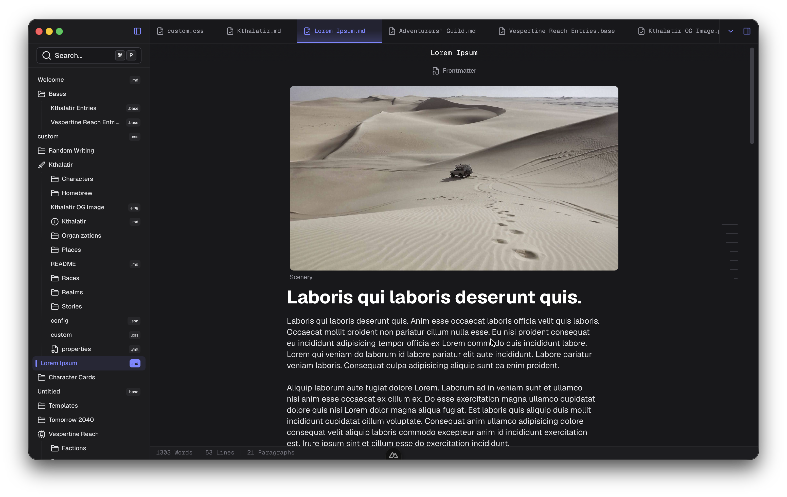

# Vertex


A Markdown Editor using `@type32/codemirror-rich-obsidian-editor` + Nuxt v4 + Nuxt UI v4 + Tauri v2.

> [!WARNING]
> Since the app is in ***ALPHA***, I highly suggest you to **NOT USE IT ON IMPORTANT VAULTS**. I've warned you here and I won't be responsible for any loss caused by the software.

> [!NOTE]
> This project falls strictly under the AGPL v3 License.

## Related Modules/Projects

- https://github.com/Type-32/obsidian-bases-parser
- https://github.com/CTRL-Neo-Studios/yaml-editor-form
- https://github.com/Type-32/codemirror-rich-obsidian
- https://github.com/CTRL-Neo-Studios/dispatcher
- https://github.com/CTRL-Neo-Studios/nuxt-predicates
- https://github.com/Type-32/tauri-sqlite-orm

## Learning

Please check out [Concepts and Structures.md](Concepts%20and%20Structures.md) to grasp general concepts of the Vertex.

For the history of this project, check out https://www.ctrl-neo.dev/projects/vertex

## Development Roadmap

https://github.com/orgs/CTRL-Neo-Studios/projects/5

## Dev & Building

Use bun.

Run dev:

```bash
bun i
bun pm trust --all
bun run tauri:dev
```

Run build:

```bash
bun i
bun pm trust --all
bun run tauri:build
```
