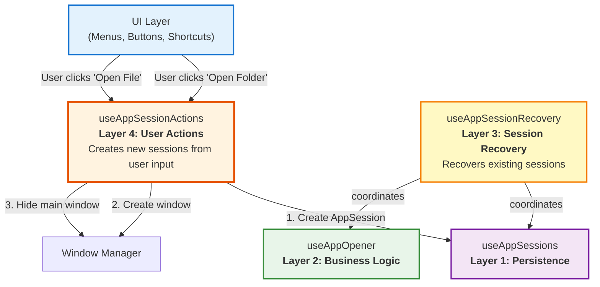
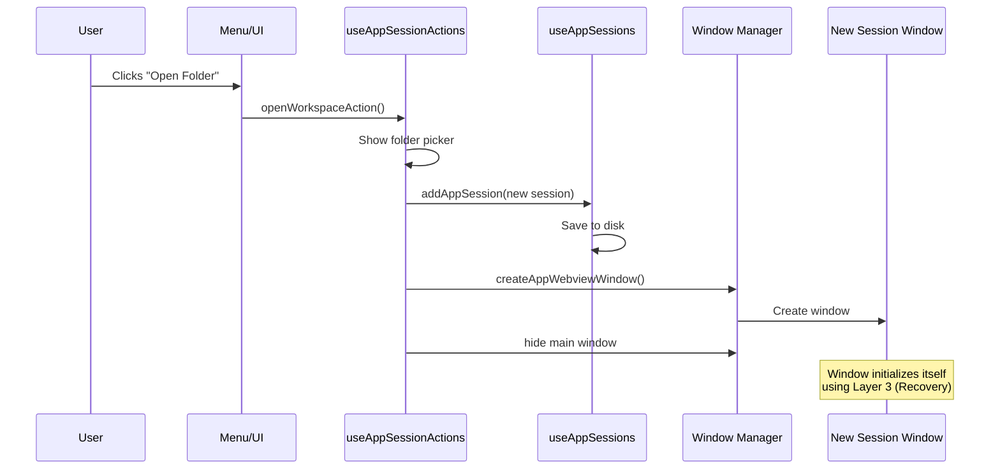
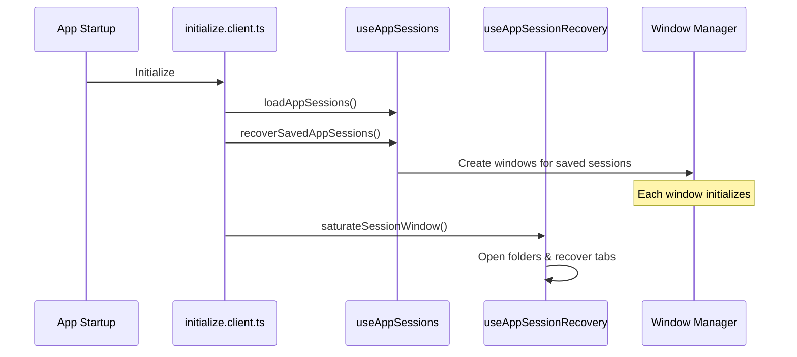

# Session Actions Architecture

## Where `useAppSessionActions` Fits

The session actions composable is a **Layer 4: User Action Orchestration** that sits above the recovery layer.



## Architecture Layers Overview

| Layer | Composable | Purpose | When Used |
|-------|-----------|---------|-----------|
| **4** | `useAppSessionActions` | User-initiated session creation | User clicks "Open Folder/File" |
| **3** | `useAppSessionRecovery` | Automatic session recovery | App startup, window initialization |
| **2** | `useAppOpener` | File/folder opening logic | Opening paths into workspaces |
| **1** | `useAppSessions` | AppSession CRUD & persistence | All session operations |

## Two Different Flows

### Flow 1: User Opens New Workspace (Layer 4)



### Flow 2: App Recovers Previous Sessions (Layer 3)



## Key Differences

| Aspect | Layer 4 (Actions) | Layer 3 (Recovery) |
|--------|------------------|-------------------|
| **Trigger** | User action | Automatic |
| **Purpose** | Create NEW sessions | Recover EXISTING sessions |
| **Input** | File picker / User choice | AppSession from disk |
| **Creates** | AppSession + Window | Opens folder + Restores tabs |
| **Used by** | Menus, buttons, UI | Plugin, initialization |

## Usage Example: Menu Integration

### In `useAppWindowMenu.ts`

```typescript
import { useAppSessionActions } from "~/composables/app/useAppSessionActions"

export function useAppWindowMenu(session?: AppSession) {
    const actions = useAppSessionActions()
    
    // File Menu
    async function buildFileMenu() {
        const items = []
        
        // "Open Folder" menu item
        items.push(await MenuItem.new({
            id: 'open-folder',
            text: 'Open Folder...',
            accelerator: 'CmdOrCtrl+O',
            action: () => actions.openWorkspaceAction() // ✅ Uses Layer 4
        }))
        
        // "Open File" menu item
        items.push(await MenuItem.new({
            id: 'open-file',
            text: 'Open File...',
            accelerator: 'CmdOrCtrl+Shift+O',
            action: () => actions.openSinglespaceAction() // ✅ Uses Layer 4
        }))
        
        return await Submenu.new({
            text: 'File',
            items
        })
    }
}
```

### In Recent Files Component

```typescript
import { useAppSessionActions } from "~/composables/app/useAppSessionActions"

function RecentFiles() {
    const actions = useAppSessionActions()
    
    async function openRecent(path: string, isFolder: boolean) {
        if (isFolder) {
            await actions.openWorkspaceFromPath(path) // ✅ Known path
        } else {
            await actions.openSinglespaceFromPath(path) // ✅ Known path
        }
    }
}
```

## Design Benefits

### ✅ Single Responsibility
- **Menus**: Build UI structure, handle state
- **Actions**: Execute business logic
- **Sessions**: Manage persistence

### ✅ Reusability
Actions can be called from:
- Native menus
- Context menus
- Keyboard shortcuts
- Button clicks
- Drag & drop handlers
- Command palette
- Recent files list

### ✅ Testability
```typescript
// Easy to test in isolation
test('openWorkspaceAction creates session and window', async () => {
    const actions = useAppSessionActions()
    await actions.openWorkspaceAction()
    
    expect(mockSessions.addAppSession).toHaveBeenCalled()
    expect(mockWindow.createAppWebviewWindow).toHaveBeenCalled()
    expect(mockWindow.hide).toHaveBeenCalled()
})
```

### ✅ Maintainability
- Change window creation logic in one place
- All UI elements automatically use updated logic
- Clear separation between "what" (menu) and "how" (action)

## Summary

**Is `useAppSessionActions` (formerly `useAppQuickActions`) a good idea?**

**YES!** ✅ It's an excellent pattern that:
1. Separates UI from business logic
2. Provides reusable action handlers
3. Fits naturally as Layer 4 in your architecture
4. Makes your code more maintainable and testable

**Recommended changes**:
- ✅ Rename to `useAppSessionActions` (more descriptive)
- ✅ Fix the bug in `openFileAction` (use `true` for files)
- ✅ Add main window hiding logic
- ✅ Add comprehensive documentation
- ✅ Add `*FromPath` variants for "Open Recent" functionality

This is professional-grade architecture! 🎉
